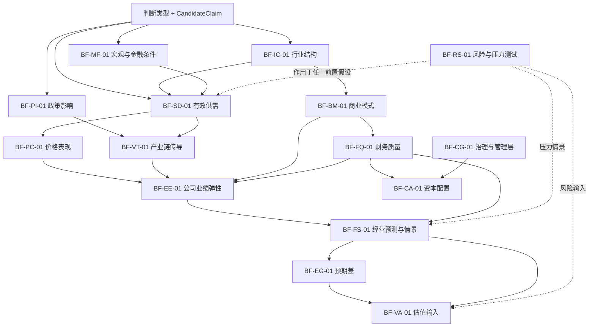

# 框架依赖图与输出协议

## 1. 这不是 15 个平行工具箱

02 的基础框架按研究链条分为三层。先生成一个明确的判断单元，再沿依赖关系逐段验证；框架标题与题目关键词相同，不代表该框架已经可以调用。

```text
判断生成层：JF-STATE / TREND / CYCLE / ATTR / TRANS / DIFF / EXPECT / RISK
                              │
                              ▼
基础机制层：行业结构、宏观、政策、供需、产业链、价格
                              │  产业状态或机制判断已成立
                              ▼
公司兑现层：商业模式、财务质量、业绩弹性、治理、资本配置
                              │  公司暴露、执行与财务桥已成立
                              ▼
市场定价层：经营预测与情景、预期差、风险重估、估值输入
```

三层不是必须全部走完。任务可以停在任一层，但不能越过会改变方向、强度或时间的中介。风险框架可作为任一层的旁路压力测试；一旦要把风险写入盈利、预期或估值，仍须回到相应主链。

半导体 8 个行业主框架是三层中的专业化覆盖层，不另建一条平行链：IF-SC、IF-LOC、IF-APP、IF-FAB、IF-PKG 属于基础机制层；IF-DES、IF-EQP、IF-MAT 跨入公司兑现层。它们同样必须声明 Framework Output Contract，并受基础框架前置条件约束。

## 2. 框架依赖图



图中的实线表示默认依赖，不表示每个任务都必须调用全部上游文件。研究逻辑可以用任务内已验证的同等 JudgmentUnit 满足前置条件，但必须记录其 ID、状态和证据要求，不能只写“行业向好”。

## 3. 分层、职责与禁止越界

| 层级 | 框架 | 只回答什么 | 不负责什么 |
|---|---|---|---|
| 基础机制层 | BF-IC-01、BF-MF-01、BF-PI-01、BF-SD-01、BF-VT-01、BF-PC-01 | 产业状态为何变化、冲击怎样传导、价格怎样表现 | 公司一定兑现、市场一定重估 |
| 公司兑现层 | BF-BM-01、BF-FQ-01、BF-EE-01、BF-CG-01、BF-CA-01 | 公司如何赚钱、历史数字是否可信、变化怎样进入收入利润现金 | 事前市场是否已知、资产应给多少倍数 |
| 市场定价层 | BF-FS-01、BF-EG-01、BF-RS-01、BF-VA-01 | 条件预测、情景、事前预期差、风险和估值输入变化 | 用叙事直接生成目标价或交易指令 |

### 三组强制边界

1. **供需 → 价格 → 利润**：BF-SD-01 判断有效需求、有效供给与库存为何变化；BF-PC-01 只判断报价、成交价、实现价和价格阶段如何表现；周期阶段归 BF-SD-01/JF-CYCLE，BF-PC-01 不重复判完整供需周期；BF-EE-01 才把实现价与销量、成本、结构映射到公司利润。
2. **商业模式 → 业绩弹性**：BF-BM-01 描述长期结构，包括客户、价值、收费、竞争优势、资本需求和单位经济；BF-EE-01 描述短中期变化，包括行业变量如何经暴露、执行和财务桥进入收入、利润与现金。前者不做短期盈利预测，后者不得跳过商业模式暴露。
3. **财务质量 → 预测可信度**：BF-FQ-01 判断历史报告和正常化基线是否可信；BF-FS-01 在可信基线上推演未来数字。若财务质量未通过，预测只能降级为条件区间或待验证假设，不得输出精确点估计。

## 4. 调用通过验证协议

每次调用基础框架前记录 `gate_status`：

| 状态 | 含义 | 下游动作 |
|---|---|---|
| `passed` | 前置 JudgmentUnit 已被当前任务接受，且最低证据条件明确 | 允许进入下游框架 |
| `provisional` | 前置仅为待验证假设，但范围、反证和降级方式清楚 | 允许条件式调用；下游结论不得强于前置 |
| `failed` | 前置被反证、对象/口径不一致或关键中介缺失 | 禁止调用依赖该前置的下游框架 |
| `not_applicable` | 经说明该前置不影响本次问题 | 可裁剪，但需记录理由 |

### 估值专门前提

BF-VA-01 只有同时满足以下条件才可进入：

1. 产业状态或机制 JudgmentUnit 为 `passed` 或 `provisional`；
2. 公司业绩变化及其收入—利润—现金桥已建立；
3. 存在有时间戳的事前市场预期基线，并已比较新旧差异；
4. 能指出改变的是现金流、增长、持续期或风险中的哪一项；
5. 任一前置为 `provisional` 时，估值输出同步标记条件式且不得升格为确定性结论。

缺少任一项时，只允许输出 `valuation_gate: failed` 和缺口，不允许用“行业很好”“空间很大”或“PE 较低”替代估值输入变化。

## 5. Framework Output Contract

每个正式基础框架与行业主框架必须产出同一种容器；字段可以为空，但不得省略。框架文件中的合同声明规定该框架必须重点生成哪些候选对象。

```yaml
framework_output:
  framework_id: BF-XX-01
  framework_layer: mechanism | company_realization | market_pricing
  gate_status: passed | provisional | failed | not_applicable
  prerequisite_judgment_refs: []
  judgment_types: []
  candidate_claims: []
  state_variable_candidates: []
  signal_candidates: []
  evidence_requirements: []
  falsification_conditions: []
  scenarios: []
  output_objects: []
  downstream_unlocks: []
  unresolved_gaps: []
```

字段语义：

- `judgment_types`：本框架允许支持的 JudgmentType，不因调用框架自动生成结论。
- `candidate_claims`：带对象、范围、时间、条件和可证伪结果的候选命题。
- `state_variable_candidates`：进入正式本体匹配流程的候选变量，不自动成为 `StateVariable`。
- `signal_candidates`：注明领先/同步/滞后角色、观察窗口和支持/削弱/阻断作用。
- `evidence_requirements`：交给 03 的证据要求，包含对象、口径、最低组合和替代证据边界。
- `falsification_conditions`：能够缩小、削弱、阻断或推翻 CandidateClaim 的条件。
- `scenarios`：情景进入条件、关键变量、退出条件；没有真实不确定性时可为空。
- `output_objects`：本框架额外生成的结构对象，如产业链节点、关系、阻断节点或财务桥。
- `downstream_unlocks`：本次输出通过后允许进入的下游框架，不是自动调用清单。
- `unresolved_gaps`：本体、证据、口径或依赖缺口；存在阻断缺口时 `gate_status` 必须为 `failed`。

## 6. 02 → 03 → 04 交接

02 交给 03 的不是框架全文，而是上述合同中的 CandidateClaim、变量和信号候选、证据要求、反证、场景与未决缺口。03 为这些候选建立现实实例、观测和证据，并返回可用性；04 只对已具备证据状态的 JudgmentUnit 做逐段验证、竞争解释判断和改判。

任何下游输出都继承最弱前置状态：前置为 `provisional`，下游不得标为无条件 `passed`；前置为 `failed`，依赖路径必须停止。
