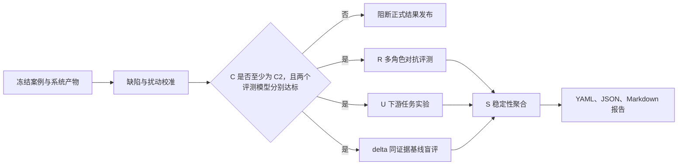

# 01 评测总纲

## 1. 评测要支持的决策

这套评测体系服务两个决策：

1. 一份研究产出的核心判断是否在当前证据边界内得到支持；
2. 复杂研究流程相较于**同证据直接生成**或普通证据摘要，是否产生了足以抵偿流程成本的研究价值。

它不试图证明报告是客观真理，也不让 AI 模拟一句“研究员觉得不错”。评测通过可重复任务、对抗审阅、证据扰动和基线实验，输出案例级裁决支持频率、案例集层代理可靠率，以及相对同证据基线的增益。

**定位**：AI 代理评测与对照实验框架，用于发现问题、比较方案、验证流程价值。未达到正式案例准入条件的 gold task 回归不得包装为系统研究可靠率证明。

## 2. 最终回答与不回答的问题

### 2.1 能回答

- 核心事实、最低证据组合和推理路径是否支持主要判断；
- 报告是否遗漏最强反证或把竞争解释写成确定因果；
- 结论强度是否超过证据许可；
- 新信息出现后，系统是否会保持、削弱、改判或正确弃答；
- 使用产出后，下游模型能否更准确地复述、跟踪、更新和设计调研问题；
- 系统产出相对同证据直接生成稿和同证据摘要稿的胜率、任务增益及错误降低；
- 上述结论在模型、提示词、重复运行和候选顺序变化下是否稳定；
- 评测器能否识别已知缺陷，而不是无条件吹捧候选。

### 2.2 不能回答

- 报告在冻结证据之外是否永远正确；
- 单案例六次裁决是否等于该判断在现实中的可靠概率；
- 对全部行业、公司、时间窗口或未知任务是否泛化；
- 研究结论是否直接构成投资建议；
- 少量 gold task 或工程回归是否代表全部研究流程；
- mock 运行的高分是否代表真实模型表现。

## 3. 核心架构

三个核心结果衡量研究价值，两个护栏决定结果是否可以解释和发布。

| 类型 | 指标 | 作用 |
|---|---|---|
| 核心结果 | `R` 可靠性 | 核心判断在冻结证据边界内是否得到支持 |
| 核心结果 | `U` 任务有用性 | 系统产物是否帮助完成真实下游研究任务 |
| 核心结果 | `delta` 相对增益 | 相对同证据直接生成与同证据摘要提升多少 |
| 发布护栏 | `S` 稳定性 | 结论是否依赖特定模型、提示或候选位置 |
| 发布护栏 | `C` 评测可信度 | 评测器是否通过缺陷、错杀、定位和扰动校准 |

旧式“证据支撑、推理成立、反证处理、判断强度、问题保持、交付可用性”只作为诊断项：前四项解释 `R`，后两项解释 `U`。终点命中只属于流程护栏，不等同研究质量。

## 4. 核心原则

### 4.1 不设综合分

`R/U/delta/S/C` 不加权合成。综合分会掩盖三类关键差异：

- 硬错误不能被表达质量抵消；
- 高任务有用性不能证明核心判断可靠；
- 高可靠性也不能证明复杂流程相对同证据基线有增益。

### 4.2 先校准评测器，再评价系统

正式流程先运行十一类缺陷、正常版错杀和四类证据扰动。整体或任一评测模型低于 `C2`，立即停止正式 `R/U/delta` 阶段。

### 4.3 评整组任务，不评一句印象

可靠性通过事实、证据、推理和对抗角色审阅；有用性通过核心复述、跟踪计划、信息更新和调研问题四项任务测量。

### 4.4 相对同证据基线优先

复杂流程的价值必须相对以下条件观察：

| 组别 | 输入 | 角色 |
|---|---|---|
| A | 只有原始问题 | 弱基线，观察裸模型 |
| B | 问题与冻结证据 | 原始材料能力 |
| C | 问题与同证据直接生成完整报告 | **主对比基线**（不经过 vNext TaskGraph 与方法路由） |
| D | 问题与系统最终允许产物 | 系统实验组 |
| E | 问题、系统产物与关键证据 | 诊断信息上限 |

另生成同证据普通摘要稿，与 C 一并作为 `delta` 主对比。问题直答不得作为“复杂流程有效”的主证据。

### 4.4a 本体价值消融阶梯（P0—P3）

除同证据基线（上表 A—E）外，验证「本体是否真的产生价值」采用消融阶梯。**禁止**只报告「调用了本体」；须报告层间增量。

| 组 | 条件 | 回答什么 |
|---|---|---|
| P0 | 普通单次 Prompt（仅问题） | 裸模型下限 |
| P1 | 使用相同 vNext TaskGraph，但移除语义 ContextReference | 受约束任务图本身的价值 |
| P2 | P1 + 冻结的本体语义切片与版本引用 | 本体是否降低术语和口径漂移 |
| P3 | 完整 vNext：TaskGraph + 本体 + 方法路由 + 证据约束 | 全栈增益 |

**本体价值主指标：**

- `Δ_ontology = score(P2) − score(P1)`：本体语义增量
- `Δ_methods = score(P3) − score(P2)`：方法库与证据约束增量

对照诊断项（可映射现有 R/U 诊断，不合成单一总分）：

| 诊断项 | 说明 |
|---|---|
| 术语与口径漂移率 | 关键指标/对象是否偏离任务口径 |
| 数字与来源错误率 | 数字是否可回溯 SourceReference 与 EvidenceFact |
| 判断结构完整度 | JudgmentUnit、状态变量、假设与证据要求是否齐全 |
| 竞争解释覆盖度 | HypothesisMap 是否保留并处理竞争解释 |
| 结论与证据匹配度 | 强度是否超过证据上限 |
| 多次运行稳定性 | 同输入重复运行分歧 |
| 未知事件适应性 | 新事件下是否正确降级/暂不可判断 |
| 返工定位清晰度 | 失败时能否指向具体 TaskNode、Artifact 与依赖边 |

每个参与消融的正式案例必须保存 P0—P3 输入指纹、模型配置、八项诊断、`Δ_ontology`、`Δ_methods`、评分者与证据边界。案例数少于 10 时只报告分布和符号方向；不得把 Δ 包装成系统准确率。若 P2 不优于 P1，必须说明是语义切片噪声、路由错误还是评分不稳定。

### 4.5 证据与时间冻结

正式评测不临时联网补证。事实核验只使用案例冻结时已经保存的短摘录、表格单元、定位和哈希，并严格过滤信息截止日后的材料。

### 4.6 正确停止也是研究价值

证据冲突时保留争议、证据不足时暂不可判断，都是有效终点。评测不强迫所有案例生成完整报告。

### 4.7 统计解释分层

- **案例级**：报告 `R0—R3`、裁决支持频率（六次中 `R≥R2` 的比例）、模型分歧、最弱判断、最强反证、硬错误。**不得**称为可靠概率，也不对单案例支持频率报告 Wilson 区间。
- **案例集级**：报告分层 R 分布、达到 `R2` 以上的案例比例（可称为代理可靠率）、D 相对同证据基线的任务增益与盲评胜率。案例数不足约 20—30 时只报告比例与分布，不报告区间。

## 5. 总体运行顺序

## 6. 当前案例状态与分层

当前没有满足本协议全部条件的冻结正式案例。`06_runtime/evals/gold-tasks.json` 只用于代表性工程合同回归，不具备双轨独立密封裁决、完整扰动集、模型隔离和同证据基线，因此不得产生 R、U、delta、S、C 或研究增益声明。

正式案例集至少覆盖正常成功、诱导失败（写得好但主判断错）和边界越级，并分别汇总 `report_value` 与 `restraint`；不得用总体通过率掩盖分层差异。

## 7. 发布纪律

正式结果必须同时满足：

- 运行配置通过模型隔离校验；
- 两个评测模型分别达到 `C2`；
- 整体 `C` 至少为 `C2`；
- 所有请求成功或失败均进入日志，不存在静默丢失；
- `report_value` 与 `restraint` 分层展示；
- 案例级只写裁决支持频率，案例集层才可写代理可靠率；
- 不得出现“系统研究可靠率为 XX%”“复杂流程已证明有效”等越级表述；
- 报告声明案例边界、最弱判断、最强反证、密封契约独立性与主要分歧。

U/C 数值阈值标记为 `pilot_threshold`，仅用于方案比较与运行阻断。

首版不要求专家标签。体系预留 5%—10% 专家盲审字段，后续用于检验 AI 代理评测与真实研究判断的一致性。
