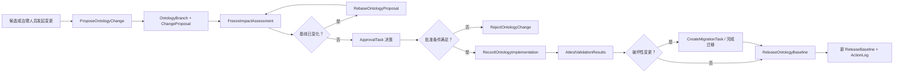

# 本体演进治理框架概述

## 1. 结论

治理需要“本体化”，但不应成为第四个投研语义域。正确做法是在 `05_control_evaluation/` 内建立独立的元治理本体：它管理正式本体及其消费者，却不参与投研事实、证据和判断推理。

这套结构借鉴 Palantir Ontology 的资源模型和变更方式，但按本项目的文件型权威、Git 版本管理与 Runtime 约束进行了落地适配。

## 2. 两个平面

| 平面 | 权威位置 | 负责回答 | 禁止承担 |
|---|---|---|---|
| 投研语义面 | `01_semantic_knowledge/01_ontology/` | 对象、状态、事件、证据、判断与研究场景 | 审批、权限、工作流、发布流程 |
| 治理控制面 | `05_control_evaluation/05_元治理本体/` | 资产权威、变更、影响、批准、检查、迁移、发布与审计 | 商业事实、投资结论、RuleEvaluation 依据 |

两个平面只通过稳定引用连接，不复制彼此定义。正式本体注册表永远不注册 `gov.*` 模型；治理实例图永远不投影为业务实例图。

## 3. Palantir 思路的本项目映射

| Palantir 概念 | 本项目实现 |
|---|---|
| Object Type | `GovernedAsset`、`ChangeProposal`、`ImpactAssessment`、`ApprovalTask`、`ValidationRun` 等治理对象 |
| Link Type | Proposal—Asset、Proposal—Impact、Impact—Consumer、Proposal—Approval 等治理关系 |
| Action Type | `ProposeOntologyChange`、`FreezeImpactAssessment`、`ApproveOntologyChange`、`ReleaseOntologyBaseline` 等唯一写入口 |
| Interface / Shared Property | 可治理资源、可审阅提案、可审计动作的公共契约 |
| Ontology Branch / Proposal | `OntologyBranch` 与 `ChangeProposal`，记录基线、差异、冲突与 rebase 状态 |
| Checks / Approvals | `ValidationRun` 与 `ApprovalTask`，在 Action 提交条件中强制执行 |
| Action Log | 每次 Action 产生追加式 `GovernanceActionLog` |
| Usage / Impact | `GovernanceConsumer`、`UsageObservation` 与 `ImpactAssessment` |
| Release | `ReleaseBaseline`，绑定当前正式本体指纹及已发布提案 |

参考的是公开的产品逻辑，不复制其专有实现。设计依据包括 [Ontology overview](https://www.palantir.com/docs/foundry/ontologies/ontologies-overview)、[Ontology branching](https://www.palantir.com/docs/foundry/ontologies/branching-ontology)、[Global Branching core concepts](https://www.palantir.com/docs/foundry/global-branching/core-concepts)、[Action types](https://www.palantir.com/docs/foundry/action-types/overview)、[Submission criteria](https://www.palantir.com/docs/foundry/action-types/submission-criteria)、[Action log](https://www.palantir.com/docs/foundry/action-types/action-log) 和 [Ontology usage](https://www.palantir.com/docs/foundry/ontology-manager/view-usage)。

## 4. 完整闭环

每次状态变化都必须由一个已注册 Action 产生。API 不再把 `next_status` 当作自由输入；状态只是 Action 执行后的结果。

## 5. 核心不变量

1. **唯一权威**：每个 `GovernedAsset` 只有一个 `authority_ref`。
2. **分支隔离**：提案在独立分支引用上形成差异，未发布前不改变正式本体基线。
3. **先影响、后批准**：影响快照必须先冻结，批准者才能看到明确的消费者、运行和检查范围。
4. **基线新鲜度**：基线指纹变化后必须 rebase；存在未解决冲突时不能批准或发布。
5. **Action 唯一写入**：治理对象的状态变化只能由 Action Type 执行。
6. **追加式历史**：ActionLog、审阅决定和检查结果不可静默改写。
7. **破坏性迁移**：破坏性变更必须有可解析、已完成的迁移任务。
8. **发布指纹一致**：发布绑定的指纹必须等于当时正式本体的当前指纹。
9. **平面隔离**：治理模型不得进入正式本体注册表、业务实例图或商业规则求值。

## 6. 执行方式

### 6.1 发起

候选经专家确认后，执行 `ProposeOntologyChange`。Action 创建 `OntologyBranch`、`ChangeProposal` 和第一条 `GovernanceActionLog`，并冻结 `base_fingerprint`。

### 6.2 影响分析

执行 `FreezeImpactAssessment`，保存：

- 变更元素 ID；
- 受影响消费者；
- 受影响运行；
- 必跑检查；
- 破坏性变更判断；
- 冻结时的基线指纹。

### 6.3 Rebase 与批准

若当前正式本体指纹与提案基线不同，先执行 `RebaseOntologyProposal`。冲突归零、影响快照仍然有效后，再由策略指定的角色处理 `ApprovalTask`。

### 6.4 实现、检查与迁移

实现引用必须指向仓库内资产。`AttestValidationResults` 只有在影响分析列出的全部检查均为 `pass` 时才能执行。破坏性变更还必须绑定已完成的 `MigrationTask`。

### 6.5 发布

`ReleaseOntologyBaseline` 再次校验目标可解析、批准满足、检查通过、无待处理 rebase、迁移完成且发布指纹与当前正式本体一致。成功后生成 `ReleaseBaseline` 和不可变 ActionLog。

## 7. 文件如何演进

- 新增治理对象、关系或 Action：修改 `models/*.yaml`，在 `model_registry.yaml` 注册，并补实例或测试。
- 修改状态：修改 `ChangeProposal.status.allowed_values` 和对应 Action 的 `state_transition`，不得在 TypeScript 里另建平行枚举图。
- 修改提交条件：先在 `models/policy.yaml` 定义规则，再由 Action 的 `submission_criteria` 引用。
- 修改受治理资产：更新 `04_context_state/03_workspace/governance_instance_graph.yaml`；旧资产目录只做兼容投影。
- 发布前运行治理校验、正式本体校验、Runtime 类型检查和测试。

## 8. 分阶段落地

本次实现完成模型、实例、校验和 Runtime Action 驱动。后续可按实际使用量逐步增加：

1. 图形化影响网络与审批工作台；
2. 基于 Git diff 自动生成 ChangeProposal 差异；
3. 由 CI 回写不可变 ValidationRun；
4. 由使用观测自动计算消费者影响；
5. 将 ReleaseBaseline 与 Git tag 或发布清单绑定。
