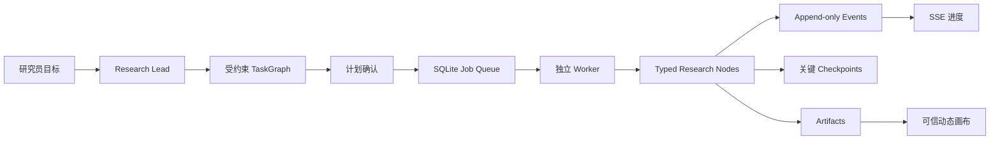

# 运行时 — 唯一能跑起来的应用

> 第一次接触项目？先读仓库根目录 [`README.md`](../README.md)。

这是整个项目**唯一能真正运行**的部分：网页、接口、AI 执行引擎、数据库都在这里。01-05 定义的业务知识，06 负责加载、组合并执行。

## 里面有什么

| 目录/文件 | 一句话说明 | 你需要管吗 |
|----------|-----------|-----------|
| `app/` | **网页和接口**：所有页面、API 路由、UI 组件 | 改界面时看 |
| `src/` | **核心程序**：AI 引擎、规划器、数据库、能力绑定 | 改逻辑时看 |
| `tests/` | 测试文件 | 改代码后要跑 |
| `scripts/` | 脚本：生成投影、审计、评测、运维 | 运维时用 |
| `connectors/akshare/` | A 股公开数据连接器（Python） | 改数据源时看 |
| `.data/` | 运行数据：SQLite 数据库、日志（不入 Git） | 备份时管 |
| `package.json` | 依赖和命令清单 | 加依赖时看 |

## 日常怎么用

### 启动系统

**方式一（推荐）**：双击项目根目录的 `start-light.command`。自动检查环境、安装依赖、构建、启动、打开浏览器。

**方式二（开发模式）**：
```bash
cd 06_runtime
npm install        # 首次安装依赖
npm run dev        # 启动网页服务
```
另开终端：
```bash
cd 06_runtime
npm run worker     # 启动后台处理进程
```
访问 `http://127.0.0.1:3000`。

### 做一次研究的流程

1. 在网页上提出研究目标
2. Research Lead（AI 助手）给出受约束的研究计划
3. 你确认计划后，后台 Worker 自动执行
4. 右侧实时展示证据、判断、报告等产出
5. 证据和判断需要你确认后才会成为正式结论
6. 报告通过审计后保持「已核验、未发布」，你确认发布才会正式输出

> 系统不会编造证据。没有匹配来源或独立发布主体不足时，判断会降级为「暂不可判断」。

## 怎么维护

### 改了 01-05 的定义后

```bash
cd 06_runtime
npm run domain:sync       # 把定义同步到程序
npm run audit:domain      # 检查跨域引用一致性
npm run audit:cutover     # 检查能力发布切换
npm run signal:evidence:rules:check # 检查信号只能作为线索、原文快照才可进证据链的规则投影
npm run build             # 重新构建
```

### 合并前必须通过的检查

```bash
npm run lint              # 静态缺陷检查（不可达代码、调试器、重复分支等）
npm test                  # 运行测试
npm run test:coverage     # 核心 Runtime/Provider/Research/Security 覆盖率门
npm run typecheck         # 类型检查
npm run audit:domain      # 跨域审计
npm run build             # 构建
```

### 数据库维护

| 命令 | 用途 |
|------|------|
| `npm run db:check` | 检查数据库完整性、列出已应用的 schema 迁移 |
| `npm run db:backup -- /路径/备份.sqlite` | 先校验再一致性快照备份（省略路径写到 `.data/backups/`） |
| `npm run db:restore -- /路径/备份.sqlite [/路径/恢复副本.sqlite]` | 校验备份后生成新的恢复副本；**不会覆盖**当前数据库 |

发布前或夜间联网运行 `npm run security:audit`：它只读取 npm 官方安全公告库，检查全部依赖的高危及以上漏洞。离线项目门禁不依赖公网，因此不会将网络不可用误判为代码失败。

### 运行模式

- **本地模式**（默认）：仅本机访问，适合单用户。`npm run start`
- **服务器模式**：需配置身份、域名白名单和 CSRF 令牌。`npm run start:server`

### 内部知识管理

需要配置 `VNEXT_INTERNAL_ADMIN_TOKEN`（API 访问）和 `VNEXT_INTERNAL_UI_ENABLED=true`（界面访问）。

## 常见问题

**Q：AKShare 连接器是什么？必须装吗？**
A：不必须。AKShare 是一个免费的 A 股公开数据接口，用于获取新闻和公告。首次启用需要本机有 `uv`（Python 包管理器）。没有它系统也能启动，只是「关注变化」功能会显示降级。

**Q：模型（AI）调用怎么控制？**
A：模型规划、推理和章节草拟都是**默认关闭**的，需要显式开启。设置 `VNEXT_PROVIDER`、对应密钥和开关环境变量。所有调用经过 Model Gateway 统一管理，记录用量、成本、延迟，执行超时和重试策略。AI 只能提出假设和候选判断，不能编造数值或越权引用。

**Q：能力上线谁说了算？**
A：由 [`03_agent_capability/releases/current.json`](../03_agent_capability/releases/current.json) 统一决定。12 个技能虽然都写好了，但只有 Release Manifest 中标记 `active` 且命中启用范围的才能在生产环境执行。

**Q：报告发布后还能改吗？**
A：判断卡和报告支持直接编辑，每次保存生成新版本。判断修改后需重新确认，报告修改后需重新审计。证据事实不能在界面中随意改写。报告通过审计后保持「已核验、未发布」，只有你在发布卡中明确确认，系统才会执行发布。

---

## 技术附录（给开发维护者）

### 技术栈

| 技术 | 版本 | 用途 |
|------|------|------|
| Next.js | 16.3.0 | Web 框架（App Router，webpack 模式） |
| React | 19.2.7 | UI 库 |
| TypeScript | 5.9.3 | 类型系统（strict，target ES2022） |
| Zod | 4.4.3 | Schema 验证 |
| Vitest | 4.1.10 | 测试框架 |
| Node.js | 24 | 运行环境（内置 `node:sqlite`） |
| tsx | 4.23.1 | TypeScript 脚本执行 |
| Python 3.12 + uv | — | AKShare 连接器 |

### 核心原则

**确定性负责边界，Agent 负责路径。**

### 关键文件索引

| 内容 | 位置 |
|------|------|
| 网页与 API | `app/` |
| Agent 内核、存储、规划 | `src/runtime/`、`src/worker.ts` |
| Ontology 5.0 Catalog 投影与 Action Service | `src/ontology/` |
| Agent/Skill/Tool 定义与发布状态 | `../03_agent_capability/`（唯一定义权威） |
| 可执行能力绑定 | `src/capabilities/registry.ts`（消费 03 生成投影） |
| 本地研究数据 | `.data/research-v2.sqlite`（可用 `VNEXT_DB_PATH` 覆盖） |
| 知识沉淀人类说明 | [`../05_control_evaluation/01_rules/knowledge_promotion.md`](../05_control_evaluation/01_rules/knowledge_promotion.md) |
| 知识沉淀机器合同 | [`../05_control_evaluation/01_rules/knowledge_promotion/knowledge_learning_contract.yaml`](../05_control_evaluation/01_rules/knowledge_promotion/knowledge_learning_contract.yaml) |
| 来源与事实晋级合同 | [`../03_agent_capability/contracts/research_provenance_contract.yaml`](../03_agent_capability/contracts/research_provenance_contract.yaml) |
| 动态规划编译合同 | [`../02_scenario_task/contracts/research_planning_contract.yaml`](../02_scenario_task/contracts/research_planning_contract.yaml) |
| 专业研报与章节方法合同 | [`../02_scenario_task/contracts/report_generation_contract.yaml`](../02_scenario_task/contracts/report_generation_contract.yaml) |
| AI 章节草拟合同 | [`../03_agent_capability/contracts/ai_report_drafting_contract.yaml`](../03_agent_capability/contracts/ai_report_drafting_contract.yaml) |
| 报告质量与正式评测准入合同 | [`../05_control_evaluation/05_evals/protocols/report_quality_evaluation_contract.yaml`](../05_control_evaluation/05_evals/protocols/report_quality_evaluation_contract.yaml) |
| 金融数据接入合同 | [`../03_agent_capability/contracts/financial_data_ingestion_contract.yaml`](../03_agent_capability/contracts/financial_data_ingestion_contract.yaml) |
| 外部连接器摄取合同 | [`../03_agent_capability/contracts/connector_ingestion_contract.yaml`](../03_agent_capability/contracts/connector_ingestion_contract.yaml) |

### 产品面

研究首页围绕 A 股公司基本面案例创建、最近研究和待办介入组织。公司工作台以非线性“决策脊柱”展示范围与问题图、证据篮子、商业模式/KPI、财务模型、判断与反证、估值边界、报告与审计。每个单元独立显示 ready、limited、blocked、waiting approval 或 invalidated，并可局部补证、重算和重审。

判断卡和报告支持直接编辑：每次保存生成新版本；判断修改后重新确认，报告修改后重新审计。证据事实不能在界面中随意改写；Agent 的初始判断只是提案，研究员必须完成一次结构化复核并保存，才可批准。

产品路由、可信交互约束与可编辑字段边界见 [`app-surface.yaml`](app-surface.yaml)。v2 是唯一产品路径；旧 API、旧工作台和数据库迁移均不保留。

### 模型调用策略

设置 `VNEXT_PROVIDER=openai|deepseek|anthropic`、对应密钥，并按需设置 `VNEXT_MODEL_PLANNING_ENABLED=true`、`VNEXT_MODEL_REASONING_ENABLED=true`、`VNEXT_MODEL_DRAFTING_ENABLED=true`。

所有调用统一经过 Model Gateway，记录 Prompt/Schema 版本、模型标识、上下文哈希、用量、成本、延迟、缓存与脱敏错误，并执行超时、有限重试和数据出境策略。来源权限会自动汇总为调用策略；`restricted`、缺少权限字段或事实找不到对应来源时，外部调用会在缓存读取之前被阻断并留下 `blocked` 记录。模型只能提出假设、证据角色、候选判断、独立批判或获得授权的章节表达；任何虚构数值、越权引用、评级或目标价都会被拒绝。财务运算、证据真实性、正式本体写入和发布仍由确定性组件控制。

### 公开公告的完整文件复验

研究员材料必须提供可定位的原文摘录；如已本地下载公开 PDF/HTML，可额外运行下列命令生成 SHA-256、字节数和媒体类型，再把结果填入“完整原始文件校验”展开项。该指纹与摘录的 `contentHash` 独立保存，文件字节不会上传到 Runtime 或外部模型。

```bash
npm run evidence:prepare-document -- --file=/绝对路径/公告.pdf
```

### 评测命令

| 命令 | 用途 |
|------|------|
| `npm run eval:live:canary` | 工程 canary（3 个案例，DeepSeek，每次最多 650 token，最多一次尝试，相同输入复用缓存） |
| `npm run eval:public:evidence:pilot` | 单个公开冻结案例的系统/直答/摘要三轨诊断（非正式、不计算胜率；默认总输出上限 980 token） |
| `npm run eval:earnings:replay` | 业绩快报确定性回放（无模型、零 token，重算同比/单位/利润差额，检查三表/估值阻断） |
| `npm run eval:earnings:runtime` | 将冻结公开业绩快报贯通到现有 Kernel，验证来源认证、财务模型、估值阻断和单一来源判断边界（无模型 token） |
| `npm run eval:earnings:verify-source -- --file=/绝对路径/PDF` | 校验已下载的公开业绩快报是否仍与冻结字节数、SHA-256 一致（不把原文发送给模型） |

### 服务器模式详情

`npm run start:server`，必须提供 `VNEXT_SERVER_IDENTITIES_JSON`、`VNEXT_ALLOWED_ORIGINS` 和 `VNEXT_SERVER_CSRF_TOKEN`。代理层统一执行 Bearer 身份、租户/用户声明、角色门、Origin/CSRF、速率限制和安全响应头。Conversation、Task、Artifact、Approval、Signal、ResearchCase 与 ActionExecution 均执行对象级租户归属检查。`tenant_admin` 只能跨用户访问同租户对象，不能跨租户。

### 已实现要点

- 独立 App/API 与独立 worker；长任务不绑在单个 HTTP 请求上
- 持久对象：Conversation、Task/TaskNode、Artifact、append-only Event、Approval、MemoryRecord
- Message/Trace 从 Event 投影；ContextPackage 为临时装配
- 当前只启用 Research Lead；其余 Agent 保持 `candidate`
- 12 个已编写 Skill 由 Capability Release Manifest 分为 active/candidate
- Domain Semantic Graph 与 Research Provenance Graph 分离
- 本体、词典、来源指南、Skill 资源包和历史正式包已接入只读增量索引
- `source.discover → source.capture → EvidenceFact` 已接通
- 证据充分性要求至少两个不同发布主体
- PlannerProposal 编译器只接受 Node Catalog 白名单
- 历史业绩更新由确定性财务引擎完成
- Task 创建时冻结 KnowledgeLock；终态后异步挖矿
- `ResearchCase` 是长期业务聚合根，`Task` 是一次可重试执行
- `ReportSpec` 随 Task 固定报告类型、受众、深度与章节
- 审计节点把运行时专业纪律诊断回写到报告可信 UI
- 统一连接器摄取入口把网页/PDF 快照和金融观测接入 provenance/ontology
- Function 只计算候选；正式 Object/Link 只由 Action Service 以原子事务写入
- Action 统一支持 `preview → approve → apply`、幂等、乐观锁、KnowledgeLock 和失效传播

### 请求生命周期



`Event` 记录发生过什么；`Checkpoint` 只回答从哪里继续。

### API（摘要）

- `GET | POST /api/v2/research-cases`
- `GET /api/v2/research-cases/{id}`
- `GET /api/v2/research-cases/{id}/events`（SSE）
- `POST /api/v2/research-cases/{id}/commands`（统一命令、乐观锁与幂等键）
- `GET /api/v2/artifacts/{id}`
- `POST /api/v2/connectors/ingest`（服务端 Token + connectorId 白名单）
- `GET /api/v2/health`
- `GET /ontology/objects/{type}/{id}/actions`
- `POST /ontology/actions/{actionType}/preview`
- `POST /ontology/actions/{actionType}/apply`
- `GET /ontology/action-executions/{id}`
- `GET /ontology/research-cases/{id}/graph`

`preview`/`apply` 请求顶层包含 `targetRefs`、`parameters`、`expectedVersions`、`idempotencyKey`、`context`，可选 `knowledgeLockId` 与 `approvalToken`。业务代码不得直接写 `ontology_objects` 或 `ontology_links`。

Judgment/Report 修订不提供通用 PATCH：必须经过 ResearchCase Command API，可编辑字段取自 05 治理投影，以乐观锁保存新版本并触发下游失效、重审或重算。

### 当前成熟度

已具备本地持久化、受约束规划、证据溯源、结构化审批、报告审计、知识沉淀控制面和可信前端。华泰智研 MCP 半导体行业景气度已完成真实调用、受授权 Runtime 映射和原始响应私密冻结。DataYes 财务表因积分不足未取得样本。正式研究价值评测须满足独立密封裁决、扰动集、模型隔离和同证据基线。

### 下一轮工程方向

1. 部署实际使用的实时网页/PDF sidecar 与金融 MCP/数据商连接器
2. 将更多领域失效路径收敛为 Catalog 生成的影响规则
3. 把 30 个冻结研究价值 fixture 逐步物化为三轨真实产物
4. 取证并行评测有收益后再启用 Evidence Investigator
