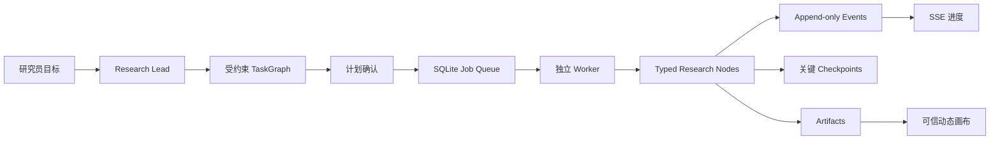

# 投研判断工作台 Runtime

> 第一次接触项目？先读仓库根目录 [`README.md`](../README.md)。

这是项目**唯一能真正跑起来**的应用与后台：网页、接口、研究 Agent、本地数据库都在这里。旧的「固定五阶段 Runtime」已退出，不要再按旧阶段状态机去理解。

## 给谁看

- **研究员**：如何启动工作台、数据存在哪、日常交互期望什么
- **开发维护者**：架构、API、验证命令（见文末附录）

## 材料从哪来

| 内容 | 位置 |
|---|---|
| 网页与 API | `app/` |
| Agent 内核、存储、规划 | `src/runtime/`、`src/worker.ts` |
| Ontology 4.0 Catalog 投影与 Action Service | `src/ontology/` |
| 可执行 Agent/Skill/Tool 清单 | `src/capabilities/registry.ts`（全仓库唯一） |
| 本地会话数据 | 默认 `06_runtime/.data/vnext.sqlite` |
| 知识沉淀人类说明 | [`05_control_evaluation/01_rules/knowledge_promotion.md`](../05_control_evaluation/01_rules/knowledge_promotion.md) |
| 知识沉淀机器合同 | [`05_control_evaluation/01_rules/knowledge_promotion/knowledge_learning_contract.yaml`](../05_control_evaluation/01_rules/knowledge_promotion/knowledge_learning_contract.yaml) |
| 来源与事实晋级合同 | [`03_agent_capability/contracts/research_provenance_contract.yaml`](../03_agent_capability/contracts/research_provenance_contract.yaml) |
| 动态规划编译合同 | [`02_scenario_task/contracts/research_planning_contract.yaml`](../02_scenario_task/contracts/research_planning_contract.yaml) |
| 专业研报与章节方法合同 | [`02_scenario_task/contracts/report_generation_contract.yaml`](../02_scenario_task/contracts/report_generation_contract.yaml) |
| AI 章节草拟合同 | [`03_agent_capability/contracts/ai_report_drafting_contract.yaml`](../03_agent_capability/contracts/ai_report_drafting_contract.yaml) |
| 报告质量与正式评测准入合同 | [`05_control_evaluation/05_evals/protocols/report_quality_evaluation_contract.yaml`](../05_control_evaluation/05_evals/protocols/report_quality_evaluation_contract.yaml) |
| 金融数据接入合同 | [`03_agent_capability/contracts/financial_data_ingestion_contract.yaml`](../03_agent_capability/contracts/financial_data_ingestion_contract.yaml) |
| 外部连接器摄取合同 | [`03_agent_capability/contracts/connector_ingestion_contract.yaml`](../03_agent_capability/contracts/connector_ingestion_contract.yaml) |

研究方法正文、本体定义、MCP 通道说明仍分别在 `01`–`05` 域；Runtime **引用**它们，不复制一份业务正文。

## 怎么用

需要 **Node.js 24**（使用内置 `node:sqlite`）。

**一键启动（macOS）：** 双击仓库根目录的 `start-light.command`；它会检查依赖、执行生产构建并启动应用与 worker。然后打开 `http://127.0.0.1:3000`。

**开发模式：**

```bash
cd 06_runtime
npm install
npm run dev
```

另开终端：

```bash
cd 06_runtime
npm run worker
```

访问 **`http://127.0.0.1:3000`**。可用环境变量 `VNEXT_DB_PATH` 覆盖数据库路径。

你在界面里提出目标 → Research Lead 给出受约束的计划 → 你确认后后台 worker 执行 → 右侧出现证据、判断等制品。证据与 Judgment 分别需要结构化确认；报告通过审计后仍保持“已核验、未发布”，只有你在发布卡中明确确认，Runtime 才会执行 `PublishDeliverable`。当前既可复用仓库内已经治理的历史来源快照，也可通过统一的认证摄取入口接收网页、PDF 和金融连接器结果；没有匹配来源或独立发布主体不足时，系统不会编造证据，判断会降级为「暂不可判断」。现有华泰智研 MCP 的半导体行业景气度已完成真实调用与受授权映射；DataYes 财务表当前因积分不足未取得样本，其他工具仍需继续映射。

模型规划和模型章节草拟均为显式开启能力。设置 `VNEXT_PROVIDER=openai|deepseek|anthropic`、对应密钥，并设置 `VNEXT_MODEL_DRAFTING_ENABLED=true` 后，Worker 会在正式 Judgment 批准后、确定性 Composer 和引用审计前调用模型。模型只能草拟获得 EvidenceFact 与 SourceReference 授权的专业章节；任何虚构数值、越权引用、评级或目标价都会导致整份模型草稿被拒绝并自动回退到确定性报告。

每份报告在审计节点都会生成逐项的专业纪律诊断，检查引用、ReportSpec 章节、MethodApplication、EvidenceFact 血缘、改判条件、定制要求与 AI 草拟边界。诊断不合成“专业总分”，也不冒充研究价值评测。用户确认发布时，Runtime 会冻结报告内容投影和证据包哈希，满足正式评测最前面的输入冻结条件；双轨独立密封裁决、四类扰动、C2 评测器校准、同证据直出/摘要基线和模型隔离仍须另行完成。正式 `R/U/delta/S/C` 的 `eligible` 也只表示可以启动协议，不表示已经通过。

## 产品面

研究员在工作台中使用三块区域：左侧是研究主题与长期会话，中间是与 Research Lead 的连续对话、计划与执行状态，右侧是证据矩阵、假设、判断卡、报告与审计时间线等可信制品。关键证据与判断生成后，系统会暂停并将确认集中在中间区域。

判断卡和报告支持直接编辑：每次保存生成新版本；判断修改后重新确认，报告修改后重新审计。证据事实不能在界面中随意改写；Agent 的初始判断只是提案，研究员必须完成一次结构化复核并保存，才可批准。

产品路由、可信交互约束与可编辑字段边界见 [`app-surface.yaml`](app-surface.yaml)。产品界面唯一实现位于 `app/`；不保留第二套前端或单独的顶层 Workspace 目录。

## 怎么维护

1. 只在本目录改可执行行为；不要在其他域「另写一套 Runtime」。
2. 改 Capability 或任务节点后，除常规测试外再跑：`node --import tsx scripts/audit-cutover.ts`。
3. 合并前验收：

```bash
npm test
npm run typecheck
npm run build
```

4. 内部知识管理页/API 需配置 `VNEXT_INTERNAL_ADMIN_TOKEN`；UI 需 `VNEXT_INTERNAL_UI_ENABLED=true`。

---

## 维护者附录（可跳过）

原则：**确定性负责边界，Agent 负责路径。**

### 已实现要点

- 独立 App/API 与独立 worker；长任务不绑在单个 HTTP 请求上
- 持久对象：Conversation、Task/TaskNode、Artifact、append-only Event、Approval、MemoryRecord
- Message/Trace 从 Event 投影；ContextPackage 为临时装配
- 当前只启用 Research Lead；其余 Agent 标为 `planned`，不会触发额外模型调用
- 5 个 Skill：research-framing、research-design、evidence-research、judgment-reasoning、research-delivery
- Domain Semantic Graph 与 Research Provenance Graph 分离
- 本体、词典、来源指南、Skill 资源包和历史正式包已接入只读增量索引；相对路径生成稳定 ID，内容哈希变化递增版本
- `source.discover → source.capture → EvidenceFact` 已接通；短引文定位、正文哈希、权限和事实晋级由确定性 Verifier 约束
- 证据充分性要求至少两个不同发布主体；历史 structured evidence packet 不冒充新抓取的原始网页或 PDF
- PlannerProposal 编译器只接受 Node Catalog 白名单，确定性检查意图、依赖、无环、证据链和预算；非法提案修复一次后回退
- 模型规划默认关闭；显式启用后仍只负责提案，不能控制 Capability、权限或执行器
- 模型章节草拟默认关闭；显式启用后只负责获得授权的章节表达，不能改写正式 Judgment、章节状态、Claim 或来源附录
- Task 创建时冻结 KnowledgeLock；终态后异步挖矿，经评测/审批/Release 后才进入后续 Context
- `ResearchCase` 是长期业务聚合根，`Task` 只是针对 Case 的一次可重试执行
- `ReportSpec` 随 Task 固定报告类型、受众、深度与章节；硬编码专业章节不可被个性化移除
- 计划确认同时展示章节级 MethodApplication 蓝图；方法 ID 只能引用受治理框架、取证与裁决目录
- EvidenceFact 按需求、供给、价格、财务、竞争等角色绑定方法；核心方法输入不完整时 Judgment 不会进入确认门
- 实际裁决后核心 MethodApplication 记录为 executed/passed，并随正式 Judgment 写入本体追溯字段
- Judgment 确认会执行 `ApproveJudgment` 写入正式本体；报告只从正式制品与已核验来源组合 Claim
- `ResearchDeliverable` 持久化 ReportSpec 投影和正式 Judgment 关系；缺少专项输入的章节明确降级为 limited
- 审计节点把运行时专业纪律诊断回写到报告可信 UI；正式研究价值缺少独立实验条件时明确显示 `not_eligible`
- 审计通过后创建 `publish_confirmation`；用户确认前报告保持 `verified_not_published`，确认后由 Ontology Action 原子发布交付物与正式 Judgment
- 发布提交同时冻结报告与证据包哈希及 Artifact 版本，为后续密封评测提供可复核输入，不生成 R/U/delta/S/C 分数
- 统一连接器摄取入口把网页/PDF 快照和金融观测接入 provenance/ontology；凭据字段被拒绝，已发布 Task 必须创建更新分支
- 华泰行业景气度回执必须携带响应指纹、字段血缘、业务时间、发布主体、风险揭示和禁止传播边界；已取得真实半导体月度样本
- Function 只计算候选；正式 Object/Link 只由 Action Service 以原子事务写入
- Action 统一支持 `preview → approve → apply`、幂等、乐观锁、KnowledgeLock 和失效传播
- `ActionExecution` 记录操作者、Action/Catalog 版本、参数、审批、语义 edits、输出、失效对象和错误

### 请求生命周期



`Event` 记录发生过什么；`Checkpoint` 只回答从哪里继续。

### API（摘要）

- `GET | POST /vnext/conversations`
- `POST /vnext/connectors/ingest`（服务端 Token + connectorId 白名单；接收 `source_capture` / `financial_data`）
- `POST /vnext/tasks/{id}/materials`（研究员结构化提交可定位摘录；仍需证据复核）
- `GET | POST /vnext/conversations/{id}/messages`
- `GET /vnext/conversations/{id}/events`（SSE）
- `POST /vnext/tasks/{id}/resume|cancel|branch`
- `POST /vnext/approvals/{id}/decision`
- `GET /vnext/artifacts/{id}`
- `PATCH /vnext/artifacts/{id}`（`expectedVersion` + editable field changes）
- 内部知识治理：`/vnext/internal/knowledge/*`
- `GET /ontology/objects/{type}/{id}/actions`
- `POST /ontology/actions/{actionType}/preview`
- `POST /ontology/actions/{actionType}/apply`
- `GET /ontology/action-executions/{id}`
- `GET /ontology/research-cases/{id}/graph`

`preview`/`apply` 请求顶层包含 `targetRefs`、`parameters`、`expectedVersions`、`idempotencyKey`、
`context`，可选 `knowledgeLockId` 与 `approvalToken`。业务代码不得直接写
`ontology_objects` 或 `ontology_links`。

Artifact PATCH 不等于 Ontology Action：它只修订 Judgment/Report 等研究制品的白名单字段，采用乐观锁保存新版本，并通过 Event 触发下游失效与重算。证据、来源和正式本体对象仍必须走各自的确定性晋级或 Action。

### 下一轮工程方向

1. 部署实际使用的实时网页/PDF sidecar 与金融 MCP/数据商连接器（认证摄取 bridge 已具备）
2. 将更多领域失效路径收敛为 Catalog 生成的影响规则
3. 用 gold task 冻结引用正确率、覆盖率、成本与返工指标
4. 取证并行评测有收益后再启用 Evidence Investigator
