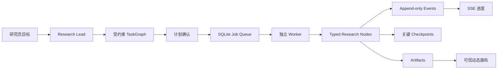

# 投研判断工作台 Runtime

> 还不了解本项目？先读仓库根目录 [新手导读.md](../新手导读.md)。

这是项目**唯一能真正跑起来**的应用与后台：网页、接口、研究 Agent、本地数据库都在这里。旧的「固定五阶段 Runtime」已退出，不要再按旧阶段状态机去理解。

## 给谁看

- **研究员**：如何启动工作台、数据存在哪、日常交互期望什么
- **开发维护者**：架构、API、验证命令（见文末附录）

## 材料从哪来

| 内容 | 位置 |
|---|---|
| 网页与 API | `app/` |
| Agent 内核、存储、规划 | `src/runtime/`、`src/worker.ts` |
| Ontology 4.0 Catalog 投影与 Action Service | `src/ontology/` |
| 可执行 Agent/Skill/Tool 清单 | `src/capabilities/registry.ts`（全仓库唯一） |
| 本地会话数据 | 默认 `07_runtime/.data/vnext.sqlite` |
| 知识沉淀人类说明 | [`05_governance/01_架构/03_知识沉淀闭环.md`](../05_governance/01_架构/03_知识沉淀闭环.md) |
| 知识沉淀机器合同 | [`05_governance/02_合同/knowledge_learning_contract.yaml`](../05_governance/02_合同/knowledge_learning_contract.yaml) |
| 来源与事实晋级合同 | [`05_governance/02_合同/research_provenance_contract.yaml`](../05_governance/02_合同/research_provenance_contract.yaml) |
| 动态规划编译合同 | [`05_governance/02_合同/research_planning_contract.yaml`](../05_governance/02_合同/research_planning_contract.yaml) |

研究方法正文、本体定义、MCP 通道说明仍分别在 `01`–`05` 域；Runtime **引用**它们，不复制一份业务正文。

## 怎么用

需要 **Node.js 24**（使用内置 `node:sqlite`）。

**一键启动（推荐）：** 在仓库根目录执行 `bash start-light.sh`，然后打开 `http://127.0.0.1:3000`。

**开发模式：**

```bash
cd 07_runtime
npm install
npm run dev
```

另开终端：

```bash
cd 07_runtime
npm run worker
```

访问 **`http://127.0.0.1:3000`**。可用环境变量 `VNEXT_DB_PATH` 覆盖数据库路径。

你在界面里提出目标 → Research Lead 给出受约束的计划 → 你确认后后台 worker 执行 → 右侧出现证据、判断等制品。当前可以复用仓库内已经治理的历史来源快照；没有匹配来源或独立发布主体不足时，系统不会编造证据，判断会降级为「暂不可判断」。实时网页/PDF 抓取和金融 MCP SourceSnapshot adapter 尚未接入。

## 怎么维护

1. 只在本目录改可执行行为；不要在其他域「另写一套 Runtime」。
2. 改 Capability 或任务节点后，除常规测试外再跑：`node --import tsx scripts/audit-cutover.ts`。
3. 合并前验收：

```bash
npm test
npm run typecheck
npm run build
```

4. 内部知识管理页/API 需配置 `VNEXT_INTERNAL_ADMIN_TOKEN`；UI 需 `VNEXT_INTERNAL_UI_ENABLED=true`。

---

## 维护者附录（可跳过）

原则：**确定性负责边界，Agent 负责路径。**

### 已实现要点

- 独立 App/API 与独立 worker；长任务不绑在单个 HTTP 请求上
- 持久对象：Conversation、Task/TaskNode、Artifact、append-only Event、Approval、MemoryRecord
- Message/Trace 从 Event 投影；ContextPackage 为临时装配
- 当前只启用 Research Lead；其余 Agent 标为 `planned`，不会触发额外模型调用
- 5 个 Skill：research-framing、research-method、evidence-assessment、hypothesis-analysis、research-writing
- Domain Semantic Graph 与 Research Provenance Graph 分离
- 本体、词典、来源指南、方法库和历史正式包已接入只读增量索引；相对路径生成稳定 ID，内容哈希变化递增版本
- `source.discover → source.capture → EvidenceFact` 已接通；短引文定位、正文哈希、权限和事实晋级由确定性 Verifier 约束
- 证据充分性要求至少两个不同发布主体；历史 structured evidence packet 不冒充新抓取的原始网页或 PDF
- PlannerProposal 编译器只接受 Node Catalog 白名单，确定性检查意图、依赖、无环、证据链和预算；非法提案修复一次后回退
- 模型规划默认关闭；显式启用后仍只负责提案，不能控制 Capability、权限或执行器
- Task 创建时冻结 KnowledgeLock；终态后异步挖矿，经评测/审批/Release 后才进入后续 Context
- `ResearchCase` 是长期业务聚合根，`Task` 只是针对 Case 的一次可重试执行
- Function 只计算候选；正式 Object/Link 只由 Action Service 以原子事务写入
- Action 统一支持 `preview → approve → apply`、幂等、乐观锁、KnowledgeLock 和失效传播
- `ActionExecution` 记录操作者、Action/Catalog 版本、参数、审批、语义 edits、输出、失效对象和错误

### 请求生命周期



`Event` 记录发生过什么；`Checkpoint` 只回答从哪里继续。

### API（摘要）

- `GET | POST /vnext/conversations`
- `GET | POST /vnext/conversations/{id}/messages`
- `GET /vnext/conversations/{id}/events`（SSE）
- `POST /vnext/tasks/{id}/resume|cancel|branch`
- `POST /vnext/approvals/{id}/decision`
- `GET /vnext/artifacts/{id}`
- 内部知识治理：`/vnext/internal/knowledge/*`
- `GET /ontology/objects/{type}/{id}/actions`
- `POST /ontology/actions/{actionType}/preview`
- `POST /ontology/actions/{actionType}/apply`
- `GET /ontology/action-executions/{id}`
- `GET /ontology/research-cases/{id}/graph`

`preview`/`apply` 请求顶层包含 `targetRefs`、`parameters`、`expectedVersions`、`idempotencyKey`、
`context`，可选 `knowledgeLockId` 与 `approvalToken`。业务代码不得直接写
`ontology_objects` 或 `ontology_links`。

### 下一轮工程方向

1. 把实时网页/PDF 与金融 MCP Tool 结果统一映射为 SourceSnapshot
2. 将更多领域失效路径收敛为 Catalog 生成的影响规则
3. 用 gold task 冻结引用正确率、覆盖率、成本与返工指标
4. 取证并行评测有收益后再启用 Evidence Investigator
