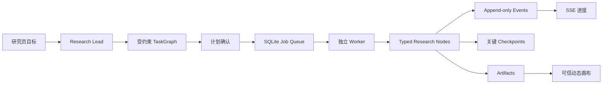

# 投研判断工作台 Runtime

这是项目唯一可执行 App 与 Agent Runtime。旧固定阶段 Runtime 已退出项目。

> 架构原则：**确定性负责边界，Agent 负责路径。**

## 已实现

- 独立 Next.js App/API 与独立 runtime worker；长任务不绑定 HTTP 请求生命周期。
- `Conversation`、`Task / TaskNode`、`Artifact`、append-only `Event`、`Approval`、`MemoryRecord` 六组持久对象。
- Message 从 Event Log 投影；Trace 从 Skill/Tool/Policy/Verifier/Event 投影；ContextPackage 是单次调用的临时对象，不另建业务实体。
- SQLite WAL、FTS5（运行环境支持时启用）、关键状态 checkpoint、外部 Tool idempotency key、模型 request fingerprint cache。
- 受约束动态任务图：Agent 只能组合 `ResearchNodeCatalog` 中具有前置条件、输出类型、不变量和恢复策略的节点。
- 当前版本只启用 `Research Lead`。Evidence Investigator、Analysis Specialist、Independent Critic 的 manifest 标记为 `planned`，不会触发额外模型调用。
- 5 个按能力性质组织的 Skill：`research-framing`、`research-method`、`evidence-assessment`、`hypothesis-analysis`、`research-writing`。
- Context Builder、Source Capture、Citation Audit、Replan 分别归入 Runtime Service、Tool、Verifier、Research Lead Policy。
- 三栏研究工作台：研究主题、连续对话、动态可信制品画布；内部工程对象不进入主导航。
- 可信组件白名单与可执行标记拦截；Agent 不能生成任意 HTML/JavaScript。
- OpenAI-compatible（含 DeepSeek）、OpenAI 与 Anthropic provider adapter；自有 loop 不绑定厂商 SDK。
- Domain Semantic Graph 与 Research Provenance Graph 分离，通过统一混合检索合同关联。

默认本地执行器不会虚构来源。没有接入真实来源 Tool 时，它会完成计划与证据审计，并把 Judgment 降级为“暂不可判断”。

## 启动

需要 Node.js 24（项目使用内置 `node:sqlite`）。

```bash
cd 07_runtime
npm install
npm run dev
```

另开一个终端启动 worker：

```bash
cd 07_runtime
npm run worker
```

访问 `http://127.0.0.1:3000`。数据默认写入 `07_runtime/.data/vnext.sqlite`，可用 `VNEXT_DB_PATH` 覆盖。

## 请求生命周期



`Event` 解释发生过什么，`Checkpoint` 只回答从哪里继续。当前关键 checkpoint 是计划确定、证据包完成、Judgment 更新和用户确认；搜索、模型调用、工具调用与 Verifier 均只记录 Event。

## API

- `GET | POST /vnext/conversations`
- `GET | POST /vnext/conversations/{id}/messages`
- `GET /vnext/conversations/{id}/events`（SSE）
- `POST /vnext/tasks/{id}/resume|cancel|branch`
- `POST /vnext/approvals/{id}/decision`
- `GET /vnext/artifacts/{id}`

## 验证

```bash
npm test
npm run typecheck
npm run build
```

测试覆盖动态路径、类型节点约束、单 Agent 拓扑、无证据正确停止、关键 checkpoint、任务分支、Tool 幂等、Memory、模型缓存、溯源和可信组件。

## 下一轮

1. 通过 adapter 接入现有本体、方法库和金融 MCP，不复制业务正文。
2. 让 `source.discover` / `source.capture` 产生真实快照和 EvidenceFact，并实现时效失效传播。
3. 用 3 个 gold task 每个运行 3 次，冻结引用正确率、覆盖率、成本、延迟和人工返工。
4. 只有在取证并行评测证明有收益时启用 Evidence Investigator。
5. Analysis Specialist 与 Independent Critic 仅在单 Agent 基线失败案例足够明确时进入 vNext.3。
