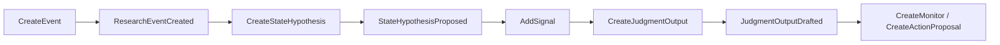

# 02-判断推理域规范

本文解释判断推理域如何把语义对象、证据、状态变量、事件、假设、信号、市场预期、预期差和资产影响连接成可追溯、可降级、可复盘的投研判断。本文不是运行端执行手册，运行端如何加载和消费这些资产见 `06_能力暴露与运行消费规范.md`。

判断推理域是整套框架的核心:它把证据和研究对象,变成一条可追溯、可复盘、可复用的投研判断。

正文用通俗语言叙述,英文名是系统内部对象/关系/动作的代号,集中在对照表里,平时阅读可以跳过。

本文主体参考 `schemas/判断推理域/` 的文件结构组织:对象对应 `objects_reasoning*.yaml`,关系对应 `relations_reasoning.yaml`,动作对应 `actions_reasoning.yaml`,规则对应 `rules.yaml`,ActionFollowup 契约对应 `actions_reasoning.yaml#side_effects`,门禁和预期差策略对应 `policies_reasoning.yaml`。

---

## 1. 它产出什么

| 产出 | 说明 |
|---|---|
| 状态表达 | 描述"发生了什么变化、怎么往下传导"。 |
| 假设表达 | 某个变量在某个时间尺度下的方向性判断,以及证伪标准。 |
| 信号验证 | 证据、事件、观测对假设和判断起什么作用。 |
| 判断输出 | 判断本身、对比的市场预期、预期差、资产影响、投资命题。 |
| 规则复用 | 把可复用的推理结构沉淀成规则、传导逻辑、传导模板、情景路径。 |
| 运行追溯 | 记录推理跑了哪些规则、走了哪些步骤,事后能回放。 |

---

## 2. 基本原则

- 判断有锚点:事件、变量、判断、预期、资产影响都要挂到语义结构域的研究对象上。
- 假设有变量:每个假设绑定一个状态变量,并声明方向、幅度、时间尺度和证伪标准。
- 信号有角色:信号要标明是验证、催化、跟踪、削弱还是阻断。
- 判断有预期:判断要和市场预期对比,形成预期差解释。
- 影响有资产:资产影响必须从某条判断派生,并作用到某个资产标的。
- 规则有轨迹:规则、规则应用、推理步骤要能支撑回放和复盘。
- 阈值引用策略:判断升级、信号激活、资产影响入库的条件引用策略/规则,行业阈值由业务包维护。
- 候选可轻量:判断记录与复盘流中,`JudgmentOutput(candidate)` 可以基于 `StateHypothesis(proposed)` 先捕捉下来;升级到 `watchlist`、`active` 或 `formalTrigger` 时经过证据、反证、竞争解释、预期差和 active 假设门禁。

---

## 3. Objects：对象一览

完整字段以 `schemas/判断推理域/objects_reasoning.yaml` 为准;所有对象都继承公共字段(id、治理层级、记录状态、有效期、观测时间等)。

| 对象代号 | 中文名 | 用途 |
|---|---|---|
| StateVariable | 状态变量 | 一个稳定、可观察的维度及其观测口径(如某产品价格、开工率)。 |
| StateVariableObservation | 状态变量观测 | 某变量在某时间点的事实读数或估算。 |
| StateVariablePropagation | 状态传导逻辑 | 两个变量之间可复用的传导机制(A 变化怎么影响 B)。 |
| DerivedMetric | 派生指标 | 由计算函数算出来的派生量(如同比、分位、估值倍数)。 |
| Event | 研究事件 | 客观发生的外部研究事实,如政策、订单、价格、技术或公司事件。它不是 ActionFollowup。 |
| StateHypothesis | 状态假设 | 某变量在某时间尺度下的方向性判断,带证伪标准。 |
| Signal | 信号 | 证据/事件/观测在推理链中起的作用。 |
| JudgmentOutput | 判断输出 | 基于假设形成的投研判断。 |
| MarketExpectation | 市场预期 | 当时市场、管理层、卖方、自身或价格隐含的预期。 |
| AssetImpact | 资产影响 | 判断对资产标的的预期影响和预期差。 |
| InvestmentThesis | 投资命题 | 围绕同一对象的长期判断集合。 |
| ScenarioModel | 场景模型 | 某类问题出现时应如何查图、查证据、跑门禁、生成解释和提交动作提案。 |
| InferenceRule | 推理规则兼容对象 | Rule Registry 中 `rule_type=inference` 的资产化兼容对象,用于沉淀需要版本、状态、复盘和运行记录的投研传导规则。 |
| ConductionTemplate | 传导模板 | 从变量 A 推导变量 B 时的检查契约。 |
| ScenarioPath | 情景路径 | 从当前状态到未来结果的路径、关键假设和证伪条件。 |
| Monitor | 监控订阅 | 对变量、假设、判断或对象集合的主动跟踪。 |
| ScenarioSimulation | 情景模拟 | 一次反事实(what-if)推演运行。 |
| HypotheticalInput | 假设性输入 | 模拟时施加的扰动输入。 |
| SimulatedImpact | 模拟资产影响 | 模拟产出的假设性资产影响,不进正式资产。 |

---

## 4. 判断推理域的最小闭环

判断推理域的最小闭环不是一次性生成完整投资结论,而是把一个研究员的真实判断变成可跟踪、可验证、可复盘的结构化对象。

主链路固定为:

| 步骤 | 做什么 | 典型产出 |
|---|---|---|
| 1. 识别事实或观测 | 从事件、变量读数或人工判断里识别变化。 | 事件、变量观测 |
| 2. 绑定研究对象 | 把变化挂到语义结构域的对象上。 | 研究锚点、对象引用 |
| 3. 形成状态假设 | 说明哪个变量、什么方向、什么时间尺度、如何证伪。 | 状态假设 |
| 4. 记录初始依据 | 保留来源、主张、事实或人工判断线索。 | 证据引用、证伪条件 |
| 5. 生成候选判断 | 先把判断接住,不要求一开始完整。 | 候选判断 |
| 6. 设置验证点 | 定义下一步要看什么信号。 | 监控、待验证指标 |
| 7. 跟踪信号和反证 | 验证、削弱、阻断或催化判断。 | 信号、反证、竞争解释 |
| 8. 对比市场预期 | 判断相对哪个预期基准有差异。 | 市场预期、预期差 |
| 9. 表达资产影响或降级 | 通过门禁则形成资产影响;否则降级为观察。 | 资产影响或观察结论 |
| 10. 到期复盘 | 对照后验结果修正判断和方法。 | 复盘记录、可复用发现 |
| 11. 沉淀复用 | 多次验证后沉淀规则、模板、情景路径或补丁。 | 可复用规则、补丁候选 |

其中,候选判断不要求一开始就具备完整证据。它只需要有明确锚点、时间尺度、方向性假设和证伪条件。随着证据、观测和市场预期逐步补齐,判断可以从 `candidate` 升级为 `watchlist`、`active` 或 `formalTrigger`。如果证据不足、预期不可比、竞争解释更强、预期差不存在或已被定价,判断应降级、阻断或进入复盘。

本域的核心不是让 AI 直接给出结论,而是让每一次判断都有来源、有假设、有验证点、有预期基准、有资产影响边界、有后验复盘,并能把验证过的逻辑沉淀为可复用的规则、模板或情景路径。

| 链路位置 | 输入 | 产出 | 主要对象 |
|---|---|---|---|
| 事实与观测 | 事件、变量观测、人工记录 | 变量读数和事件影响 | Event、StateVariableObservation |
| 状态理解 | 变量、传导逻辑、事件、观测 | 状态假设 | StateVariable、StateVariablePropagation、StateHypothesis |
| 信号验证 | 事实、事件、观测、假设 | 验证、跟踪、削弱或阻断信号 | Signal |
| 判断生成 | 状态假设、信号、时间尺度 | 判断输出 | JudgmentOutput |
| 预期基准 | 市场/价格隐含/管理层/卖方/自身预期 | 可比较的预期截面 | MarketExpectation |
| 预期差判断 | 判断、市场预期、定价观测 | 预期差方向、幅度、依据、定价反映状态 | judgmentComparedWithExpectation |
| 资产影响 | 判断、资产、预期差结果 | 资产影响、投资命题 | AssetImpact、InvestmentThesis |
| 监控与复盘 | 监控命中、到期复盘、推理运行 | 复盘结论和方法修正 | Monitor、ReviewRecord |
| 规则沉淀 | 已结算判断、复盘记录 | 可复用规则、模板、情景路径 | Rule Registry 中的 inference rule、InferenceRule、ConductionTemplate、ScenarioPath |

### 4.1 判断状态分层

| 状态 | 含义 | 最低要求 | 允许用途 |
|---|---|---|---|
| `candidate` | 候选判断 | 有研究对象、时间尺度、方向性假设、初始依据和证伪条件 | 记录、追踪、等待验证 |
| `watchlist` | 观察判断 | 已设置下一验证点,至少有一个跟踪信号或待验证指标 | 进入监控台账 |
| `active` | 生效判断 | 至少一个验证信号,检查过竞争解释,基础假设未被阻断 | 可用于内部分析和持续跟踪 |
| `formalTrigger` | 正式触发判断 | 至少两条独立验证信号,完成预期差检查,资产影响门禁通过 | 可进入正式研究输出流程,但仍不得生成买卖建议 |
| `resolved` | 已结算判断 | 到达复盘时点,完成结果复盘 | 用于规则沉淀、经验复用、错误归因 |
| `downgraded` | 降级判断 | 证据不足、预期不可比、竞争解释更强、催化不足或定价已反映 | 保留历史,不作为高置信结论 |
| `blocked` | 被阻断判断 | 核心假设被反证或关键条件不成立 | 停止向资产影响升级 |
| `deprecated` | 废弃判断 | 判断对象、口径或逻辑已不再适用 | 归档保留,不再用于推理 |

### 4.1.1 输出强度分级

| 等级 | 含义 | 允许输出 |
|---|---|---|
| `blocked` | 核心假设被阻断 | 停止结论升级，只说明阻断原因 |
| `observation` | 有线索但证据不足 | 输出观察结论和待补证任务 |
| `analysis` | 证据和规则基本支撑 | 输出内部分析、风险和跟踪指标 |
| `formalTrigger` | 证据、反证、预期差和资产影响门禁通过 | 可进入正式研究输出流程，但仍不得生成买卖建议 |

### 4.2 判断记录与复盘流盒子

`JudgmentRecord` 是 team workspace 的最低摩擦入口，服务“先记录原话，再持续验证”。它不是本域的正式本体对象，也不参与正式 runtime 默认加载。研究员可以用一句自然语言明确要求记录判断，例如：

> 我觉得这次出口管制会推高磷化铟价格,未来 1-2 个季度可能影响光模块成本。

系统不要求研究员先填写完整对象，而是自动拆成原话、锚点、假设、候选变量、所需数据、支持信号、证伪条件和下次复盘时间：

| 阶段 | 对象 | 要点 |
|---|---|---|
| 明确记录 | `JudgmentRecord` | 保存原话和工作流状态，不自动当事实。 |
| 运行验证 | `RuntimeEvidenceSnapshot` / `JudgmentOutput` | 使用正式框架和当次证据形成可降级输出。 |
| 到期复盘 | workspace retrospect / `ReviewRecord` | 对比原判断、后验事实、反证和偏差。 |
| 候选筛选 | promotion assessment | `record_only`、`retrospect_pool` 或 `ontology_candidate`。 |
| 框架生产 | workbench candidate / `PatchRequest` | 达到门槛也只能生成候选，正式晋升仍需 owner 审核。 |

这条流的边界遵循 `schemas/common.yaml.global_research_output_boundary`;资产层只表达 `AssetImpact`、预期差和定价反映状态。

### 4.3 应用层附注：JudgmentRecord 是工作流记录

判断追踪页可以围绕 `JudgmentRecord` 展示信息，但展示方式不改变记录的契约身份：它不是 `ObjectViewSpec`、不是 `JudgmentOutput`，也不是新的本体对象类型。正式对象和关系仍由 bundle 承载，工作区只保存引用与流程状态。

`CaptureJudgment` 是持久化入口；`AnalyzeEventImpact` 默认只完成当次分析，只有用户明确要求持续跟踪或复盘时才创建或更新 `JudgmentRecord`。普通问答不得自动污染长期判断资产。

---

## 5. Actions：可以做哪些动作

完整定义以 `schemas/判断推理域/actions_reasoning.yaml` 为准;每个动作都生成动作记录。状态流转由动作加策略/规则共同决定:信号先建候选(`AddSignal`),来源和门禁通过后才激活(`ActivateSignal`);判断默认是候选,再分阶段升级;资产影响只能从判断派生、作用到资产,预期差检查不过就进审核或补证。行业差异通过策略、模板、情景路径或场景加载规则注入,不写死在动作里。

第 7–8 节从**动作执行契约**角度说明各动作引用的门禁规则与发出的 ActionFollowup。

事实、状态与假设:

| 动作代号 | 作用 |
|---|---|
| CreateEvent | 新建事件。 |
| CreateStateVariable | 新建状态变量。 |
| CreateStateVariableObservation | 记录一条变量观测。 |
| ComputeDerivedMetric | 计算并记录派生指标。 |
| CreateStateHypothesis | 新建状态假设。 |
| CreateStateVariablePropagation | 新建状态传导逻辑。 |
| ActivateHypothesis | 激活假设。 |
| BlockHypothesis | 阻断假设。 |
| SupersedeHypothesis | 用新假设替代旧假设。 |
| DeprecateHypothesis | 废弃假设。 |
| LinkHypotheses | 建立假设之间的关系。 |

信号:

| 动作代号 | 作用 |
|---|---|
| AddSignal | 新建候选信号及角色关系。 |
| ActivateSignal | 信号通过检查后激活。 |
| UpdateSignal | 修改信号。 |
| UpdateSignalStatus | 把信号置为过期/撤回/失效。 |

判断、预期、资产影响、命题:

| 动作代号 | 作用 |
|---|---|
| CreateJudgmentOutput | 新建判断(默认候选)。 |
| UpgradeJudgmentToWatchlist | 判断升级为观察。 |
| UpgradeJudgmentToActive | 判断升级为生效。 |
| UpgradeJudgmentToFormalTrigger | 判断升级为正式触发。 |
| DowngradeJudgment | 判断降级。 |
| BlockJudgment | 核心假设被反证或关键条件不成立时阻断判断。 |
| ResolveJudgment | 判断结算。 |
| DeprecateJudgment | 废弃判断。 |
| CreateMarketExpectation | 新建市场预期。 |
| CreateAssetImpact | 新建资产影响。 |
| CreateInvestmentThesis | 新建投资命题。 |
| UpdateThesisStatus | 更新投资命题状态。 |

规则、模板、情景与模拟:

| 动作代号 | 作用 |
|---|---|
| CreateInferenceRule | 新建推理规则(初始为待审核规则)。 |
| DeprecateInferenceRule | 废弃推理规则。 |
| CreateConductionTemplate | 新建传导模板。 |
| CreateScenarioModel | 新建场景模型。 |
| CreateScenarioPath | 新建情景路径。 |
| RunSimulation | 跑一次情景模拟。 |
| CompareSimulations | 对比多个模拟(基准/上行/下行/压力)。 |
| PromoteSimulation | 把模拟结论转成补丁。 |

监控与运行轨迹:

| 动作代号 | 作用 |
|---|---|
| CreateMonitor | 新建监控订阅。 |
| EvaluateMonitor | 评估监控条件,命中则触发下一步。 |
| PauseMonitor | 暂停监控。 |
| RecordRuleApplication | 记录一次规则应用。 |
| RecordReasoningStep | 记录一次推理步骤。 |

---

## 6. Relations：关系一览

完整定义以 `schemas/判断推理域/relations_reasoning.yaml` 为准,关系都有方向。

状态与事件:

| 关系代号 | 起点 → 终点 | 含义 |
|---|---|---|
| observedOn | 状态变量 → 研究对象 | 变量挂到研究对象上。 |
| observationBindsVariable | 观测 → 变量 | 观测值归属哪个变量。 |
| propagatesFrom | 传导逻辑 → 源变量 | 传导的源头变量。 |
| propagatesTo | 传导逻辑 → 目标变量 | 传导的目标变量。 |
| derivedFromVariable | 派生指标 → 变量/观测 | 派生指标的计算输入。 |
| metricObservedOn | 派生指标 → 研究对象 | 派生指标挂到研究对象上。 |
| eventRelatesToEvent | 事件 → 事件 | 事件间的触发、使能、缓解、替代、反向或共现。 |
| eventAffectsVariable | 事件 → 变量 | 事件对变量的方向性影响。 |
| eventProducesObservation | 事件 → 观测 | 事件产生某条观测。 |
| eventTriggersPropagation | 事件 → 传导逻辑 | 事件触发或解释某个传导。 |
| observationIndicatesPropagation | 观测 → 传导逻辑 | 观测显示某个传导发生了。 |
| propagationSupportsHypothesis | 传导逻辑 → 假设 | 传导支持形成或维持某假设。 |

假设、信号与判断:

| 关系代号 | 起点 → 终点 | 含义 |
|---|---|---|
| anchoredOn | 事件 → 研究对象 | 事件挂到研究对象上。 |
| basedOnEvent | 假设 → 事件 | 假设由事件引发。 |
| basedOnObservation | 假设 → 观测 | 假设基于观测。 |
| hypothesisBindsVariable | 假设 → 变量 | 假设绑定变量。 |
| competesWithHypothesis | 假设 → 假设 | 两个假设互为竞争解释。 |
| supersedesHypothesis | 假设 → 假设 | 新假设替代旧假设。 |
| dependsOnHypothesis | 假设 → 假设 | 假设依赖另一前提假设。 |
| judgmentRelatesToJudgment | 判断 → 判断 | 判断间的依赖、替代、细化、更新或冲突。 |
| signalBasedOnObservation | 信号 → 观测 | 信号来源于观测。 |
| signalBasedOnEvent | 信号 → 事件 | 信号来源于事件。 |
| supportsHypothesis | 信号 → 假设 | 验证型信号支持假设。 |
| tracksHypothesis | 信号 → 假设 | 跟踪型信号跟踪假设。 |
| weakensHypothesis | 信号 → 假设 | 削弱型信号削弱假设。 |
| blocksHypothesis | 信号 → 假设 | 阻断型信号阻断假设。 |
| judgmentAnchoredOn | 判断 → 研究对象 | 判断挂到研究对象上。 |
| basedOnHypothesis | 判断 → 假设 | 判断基于假设。 |
| supportsJudgment | 信号 → 判断 | 验证型信号支持判断。 |
| catalyzesJudgment | 信号 → 判断 | 催化型信号催化判断。 |
| tracksJudgment | 信号 → 判断 | 跟踪型信号跟踪判断。 |
| weakensJudgment | 信号 → 判断 | 削弱型信号削弱判断。 |

预期、资产影响与投资命题:

| 关系代号 | 起点 → 终点 | 含义 |
|---|---|---|
| expectationAnchoredOn | 预期 → 研究对象 | 预期挂到研究对象上。 |
| expectationBasedOnObservation | 预期 → 观测 | 预期基于观测。 |
| expectationBasedOnEvent | 预期 → 事件 | 预期基于事件。 |
| expectationSupersedesExpectation | 预期 → 预期 | 新预期替代旧预期。 |
| judgmentComparedWithExpectation | 判断 → 预期 | 判断与预期比较,识别预期差。 |
| impactDerivedFrom | 资产影响 → 判断 | 资产影响来源于判断。 |
| impactsAsset | 资产影响 → 资产 | 资产影响作用于资产。 |
| impactReferencesExpectation | 资产影响 → 预期 | 资产影响引用预期。 |
| thesisAnchoredOn | 投资命题 → 研究对象 | 投资命题挂到研究对象上。 |
| thesisContainsJudgment | 投资命题 → 判断 | 投资命题包含某条判断。 |

模拟与监控:

| 关系代号 | 起点 → 终点 | 含义 |
|---|---|---|
| simulationUsesPath | 情景模拟 → 路径/模板/传导 | 模拟用了哪条路径或传导。 |
| simulationAnchoredOn | 情景模拟 → 研究对象 | 模拟挂到研究对象上。 |
| inputToSimulation | 假设性输入 → 情景模拟 | 扰动输入归属某次模拟。 |
| simulatedImpactFromSimulation | 模拟资产影响 → 情景模拟 | 模拟影响来自哪次模拟。 |
| simulatedImpactsAsset | 模拟资产影响 → 资产 | 模拟产物对资产的假设性影响。 |
| monitorWatches | 监控 → 被监控对象 | 监控订阅了哪个变量/假设/判断/集合。 |
| monitorTriggeredSignal | 监控 → 信号 | 监控命中后触发生成的信号。 |

---

## 7. Rules：推理资产与门禁规则

### 7.1 推理资产（What 层）——不是 `rules.yaml` 里的 gate

判断推理域里有几类对象都像"可复用逻辑",但职责不同。它们属于 Logic **What** 层,完整分层见 `references/06_能力暴露与运行消费规范.md` 第 5 节:

| 对象 | 作用 | 与 gate rules 的分工 |
|---|---|---|
| `InferenceRule` | 可版本化的传导判断规则 | `rule_type=inference` 可资产化为此对象;执行走 `functionRef` |
| `StateVariablePropagation` | 变量间传导关系 | 声明传导图,不替代激活门禁 |
| `ConductionTemplate` | 传导检查项与反证模板 | 编排用,不替代 `blocking` 规则 |
| `ScenarioPath` | 情景路径与证伪条件 | 复盘沉淀用 |
| `ScenarioModel` | 场景入口与加载编排 | **Which** 层;选择 refs、门禁、Function |

证据质量、权限、动作前置和后续信号触发规则**不**放进 `InferenceRule`,应回到证据域或治理域 `rules.yaml`。复杂执行逻辑通过 `functionRef` 指向治理域 `LogicFunction`;每次规则跑动都有一条规则应用记录。

### 7.2 门禁规则（gate）——`schemas/判断推理域/rules.yaml`

门禁规则回答「这一步能不能做、做到哪一步」,在 Action 执行前/中检查。公共 `enforcement_contract` 等级见 `00_框架概述` §8.3。

#### `reasoning.inference.event_to_state_hypothesis.minimum_trace`（inference）
- **回答问题**：外部事件能否形成状态假设？
- **检查时机**：`CreateStateHypothesis`、`CreateInferenceRun`
- **执行者**：`skill_must_check`
- **通过**：`StateHypothesis` 候选 → **失败**：降级观察或 `ontology_feedback.missing_anchor`
- **正/反例**：Event 已 `anchoredOn` 且有 EvidenceClaim 支撑 ✓；只有标题无锚点 ✗

#### `reasoning.validation.signal_role_relation_compatibility`（validation）
- **回答问题**：信号角色和关系类型是否一致？
- **检查时机**：`AddSignal`、`ActivateSignal`
- **执行者**：`schema_enforced`
- **通过**：关系允许 → **失败**：`block_next_action`

#### `reasoning.scoring.confidence_composition.minimum_chain`（scoring）
- **回答问题**：多跳链置信度追溯是否完整？
- **检查时机**：`CreateInferenceRun`、`CreateJudgmentOutput`
- **执行者**：`policy_gate`
- **通过**：输出置信度 → **失败**：`lower_confidence`

#### `reasoning.promotion.judgment_active_gate`（promotion）
- **回答问题**：判断能否升到 active？
- **检查时机**：`UpgradeJudgmentToActive`
- **执行者**：`policy_gate` + `human_review_required`
- **通过**：active 判断 → **失败**：进审核队列

#### `reasoning.blocking.active_blocking_signal`（blocking）
- **回答问题**：是否存在未失效的阻断信号？
- **检查时机**：`ActivateSignal`、`UpgradeJudgmentToActive`、`CreateAssetImpact`
- **执行者**：`skill_must_check`
- **通过**：继续 → **失败**：`block_conclusion`（不是仅降置信度）

#### `reasoning.trigger.runtime_data_freshness_change`（trigger）
- **回答问题**：观测新鲜度变化要不要发 ActionFollowup？
- **检查时机**：`CreateStateVariableObservation`、`EvaluateMonitor` 之后
- **执行者**：`policy_gate`（`runtime_data_requirements.yaml`）
- **输出**：`DataFreshnessChanged` 或 `DataStaleDetected`（**规则触发**,非 Action 直接发出）
- **说明**：数据过期走 ActionFollowup;结构缺口走 `ontology_feedback`

### 7.3 按动作族看门禁（执行契约矩阵）

| 动作族 | 代表动作 | 必经 gate / inference | 失败时 |
|---|---|---|---|
| 事件→假设 | `CreateStateHypothesis` | `event_to_state_hypothesis.minimum_trace`（`inference_consumer_rule_refs`） | 降级观察 |
| 信号 | `AddSignal`、`ActivateSignal` | `signal_role_compatibility`、`active_blocking_signal` | 阻断或审核 |
| 判断创建 | `CreateJudgmentOutput` | `confidence_composition.minimum_chain`（`inference_consumer_rule_refs`） | 降置信度 |
| 判断升级 | `UpgradeJudgmentToActive` | `judgment_active_gate`、`active_blocking_signal` | 审核 |
| 资产影响 | `CreateAssetImpact` | `active_blocking_signal` + 预期差 policy | 阻断 |
| 观测新鲜度 | `CreateStateVariableObservation` | `runtime_data_freshness_change` | 发 ActionFollowup |

---

## 8. 研究 Event 与 ActionFollowup

本节分两层:**研究事件对象**（外部事实）与 **ActionFollowup**（Action/Rule 的 side effect）。公共 ActionFollowup 约定见 `00_框架概述` §8.2。

### 8.1 研究事件 `Event`（语义对象，不是 ActionFollowup）

`Event` 表示外部世界已发生或被材料声称发生的事实:政策变化、订单变化、价格异动、技术突破、公司公告等。它通过 `anchoredOn`、`eventAffectsVariable`、`basedOnEvent` 等关系进入推理链。

- 材料入口:证据域 `EvidenceClaim`/`EvidenceFact` → 判断推理域 `CreateEvent`
- 不表示系统动作完成;不要用 ActionFollowup 承载外部事实原文

### 8.2 主推理链（ActionFollowup side effects）

`ResearchEventCreated` 的含义是「研究事件**对象**已创建」的系统通知,不是外部事实本身的复制品。

### 8.3 ActionFollowup 卡片（`actions_reasoning.yaml#side_effects`）

| 事件 | 触发源 | 推荐载荷（除公共字段外） | 下游 |
|---|---|---|---|
| `ResearchEventCreated` | Action `CreateEvent` | — | `CreateStateHypothesis`、`CreateInferenceRun` |
| `StateVariableObservationRecorded` | Action | `stateVariableId`、`observationTime`、`freshnessPolicyRef` | `EvaluateMonitor`、`AddSignal`、`CreateInferenceRun` |
| `DataFreshnessChanged` | Action 或 **Rule** `runtime_data_freshness_change` | `runtimeDataRequirementKey`、前后 freshness bucket | 重跑推理、调信号 |
| `StateHypothesisProposed` | Action | — | `AddSignal`、`CreateJudgmentOutput` |
| `InferenceRuleMatched` | Action | — | 记录 `RuleApplication` 步骤,非修改 InferenceRule 对象 |
| `JudgmentOutputDrafted` | Action | — | 审核、`CreateMonitor` |
| `MonitorEvaluated` | Action | — | `RecordReviewOutcome`、`CreateActionProposal` |

由治理域 `RecordActionFollowup` 落库;下游路由受 `governance.trigger.followup_to_next_action` 约束。

### 8.4 运行时数据事件（Rule 触发）

| 数据变化 | ActionFollowup | 触发源 | 典型下游 |
|---|---|---|---|
| 新增观测 | `StateVariableObservationRecorded` | Action | 监控、加信号、推理运行 |
| 新鲜度桶变化 | `DataFreshnessChanged` | **Rule** | 重跑推理、调信号 |
| 必需数据过期 | `DataStaleDetected` | **Rule** | 补证、降级（治理域编排见 `04` §7.4） |
| 正式判断数据越界 | `DataRequirementBreached` | **Rule** | 审核、补证 ActionProposal |

这些事件驱动业务闭环,但不等同于 `ontology_feedback`。

---

## 9. Objects 补充：计算函数、派生指标与模拟

### 9.1 计算函数与派生指标

计算函数读取输入并生成派生量;结果以派生指标(`DerivedMetric`)资产化保存,记录算法引用和刷新策略。资产价格、估值、成交、市场反应这类数据,以 `asset_pricing` 类别的状态变量和观测表达。

### 9.2 what-if 模拟

情景模拟做反事实推演,默认产出模拟资产影响。假设性输入标明为"假设的";需要把模拟结论转为正式资产时,通过补丁和治理流程处理。

`ScenarioSimulation`、`HypotheticalInput` 和 `SimulatedImpact` 属于增强能力,不是判断推理域最小闭环的必需对象。MVP 阶段可以只保留对象定义,不要求消费型任务能力每次判断都生成模拟结果。

---

## 10. Policies：预期差判断契约

这是判断推理域最关键的一步,回答:**研究判断相对当时市场或自身预期,差在哪、差多少、价格反映到了什么程度、后面怎么复盘。**

### 10.1 需要哪些输入

| 输入 | 必填要点 |
|---|---|
| 研究判断 | 判断内容、时间尺度、锚点、所基于的假设 |
| 预期基准(MarketExpectation) | 预期类型、对象、预期值、时间尺度、截面时点、来源、定价状态 |
| 事实依据 | 业务时间、来源、可信度、对应变量或对象 |
| 资产上下文 | 资产标的、业务暴露、定价状态或价格隐含预期 |

### 10.2 怎么做

| 步骤 | 做什么 |
|---|---|
| 建立预期截面 | 记录共识预期、价格隐含预期、管理层指引、卖方观点或自身预期。 |
| 对齐时间尺度 | 比较判断和预期的时间尺度,是否可比。 |
| 对齐预期对象 | 比较预期所指的对象和判断所指的变量/对象/资产。 |
| 识别预期差 | 用 `judgmentComparedWithExpectation` 记录比较角色、方向、幅度和依据。 |
| 形成资产影响 | 写入预期差方向、状态、幅度、依据和定价评估。 |
| 记录推理轨迹 | 在规则应用里留下预期检查和预期差检查的过程。 |

### 10.3 预期基准不足时如何降级

没有预期基准,不得直接生成高置信资产影响。基本面判断即使方向正确,也必须先回答"是否已经被市场预期或价格反映"。

| 情况 | 允许输出 |
|---|---|
| 没有市场预期 | 只能输出观察级判断,记录预期缺口和补证任务。 |
| 有模糊预期 | 可以输出低置信预期差,不得作为高置信资产影响。 |
| 有明确预期截面 | 可以输出正式预期差判断。 |
| 有价格隐含预期和资产定价观测 | 可以进入资产影响和后验复盘。 |

### 10.4 产出与去向

| 产出 | 落在哪 | 用途 |
|---|---|---|
| 预期基准 | MarketExpectation | 保存当时各类预期截面。 |
| 预期差关系 | `judgmentComparedWithExpectation` | 保存判断与预期的比较结论。 |
| 资产影响的预期差 | AssetImpact 的预期差字段 | 保存资产层面的预期差结论。 |
| 定价反映状态 | `pricedInAssessment` 等 | 区分"基本面判断对"和"资产真的涨了"。 |
| 运行轨迹 | 规则应用、推理运行 | 复盘当时是否检查过预期和预期差。 |
| 后验复盘 | 复盘记录 | 复盘预期差是否真实、是否按预期收敛、是否被提前定价。 |

### 10.5 质量底线

- 形成资产影响前优先记录预期;取不到预期就降级为观察级判断、降低置信度并记录原因。
- 判断和预期的时间尺度要可比,不可比就拆分或记录原因。
- 比较依据要说清差异来自哪个指标、变量、叙事或定价状态。
- 资产影响要填预期差方向;非未知时关联预期或填写依据。
- 复盘要记录预期差和定价是否复盘过。

### 10.6 结构化预期与定价观测

原始预期口径保留材料原文;可量化的预期再用 `expectedValueStructured` 记录指标、比较符、数值、上下界、单位、基准和方向。价格隐含预期连到 `asset_pricing` 类的定价观测上,用来复盘基本面判断有没有转化成资产表现。

### 10.7 独立来源判定

独立来源判定用于识别多条证据是否真正来自不同来源,避免同一条消息被多家转载后重复计数。信号通过来源关系追溯到来源文档;转载、AI 摘要、人工录入继承原始来源,作为线索处理;结果用 `independentSourceCount` 等字段记录在规则应用里。

### 预期差相关字段对照

| 字段代号 | 含义 |
|---|---|
| expectationGapDirection | 预期差方向 |
| expectationGapStatus | 预期差状态 |
| expectationGapMagnitude | 预期差幅度 |
| expectationGapBasis | 预期差依据 |
| pricedInAssessment | 是否已被定价的评估 |
| market_expectation_checked | 是否检查过市场预期 |
| expectation_gap_checked | 是否检查过预期差 |
| expectationGapReviewed | 复盘是否复核过预期差 |
| pricingReviewed | 复盘是否复核过定价反映 |
| impactReferencesExpectation | 资产影响引用了哪条预期 |

---

## 11. Policies：层间质量门禁

判断从一层升到下一层,要过对应的检查(机器定义见 `schemas/判断推理域/policies_reasoning.yaml`):

| 从 → 到 | 通过条件 |
|---|---|
| 事实观测 → 状态理解 | 事件影响变量、观测绑定变量,观测是事实或估算。 |
| 状态理解 → 信号验证 | 假设可接收信号,信号有来源,角色与作用一致。 |
| 信号验证 → 判断与影响 | 分层升级:candidate 有锚点、时间尺度、初始依据和证伪条件即可;watchlist 至少有下一验证点或跟踪信号;active 至少有一个验证信号、竞争解释检查和 active 基础假设;formalTrigger 至少两条独立验证信号,完成预期差检查并通过资产影响门禁。 |
| 判断与影响 → 规则模板 | 判断已结算或到期,且已有复盘结论。 |
| 规则模板 → 运行轨迹 | 规则/模板已生效,推理运行记录了本体版本。 |
| 运行轨迹 → 反馈闭环 | 存在缺口步骤或运行失败时,生成候选补丁或反馈。 |

冷启动新生成的规则、传导模板、情景路径初始都是待审核资产,通过审核准入后变为可复用资产(机器契约见 `cold_start_template_admission`)。

### 11.1 复盘结果类型

复盘不能只沉淀成功规则,也要沉淀失败教训。下表只保留判断推理域最常见的结果类型;完整审核、补丁和复用晋升规则见 `04_治理域规范.md`。下列结果类型可由 `ReviewRecord` 的基本面、时间点、催化、资产影响、预期差和定价复盘字段承载:

| 复盘类型 | 典型含义 | 后续处理 |
|---|---|---|
| 判断对了但资产影响未兑现 | 基本面方向正确,但资产价格没有反应或反应不足 | 检查定价、流动性、资产暴露和时间窗口。 |
| 判断错了 | 基础假设或关键变量方向错误 | 记录反证来源,修正规则或变量口径。 |
| 方向对了但时间错了 | 最终发生,但早于或晚于判断时间窗 | 修正时间尺度、滞后关系和监控点。 |
| 基本面对了但预期差不存在 | 事实兑现,但市场本来就这么预期 | 降低资产影响置信度,强化预期基准检查。 |
| 预期差存在但已被定价 | 判断有差异,但价格已经提前反映 | 强化价格隐含预期和定价观测。 |
| 逻辑对了但催化剂没来 | 传导链成立,但缺少触发因素 | 调整催化信号和 formalTrigger 门槛。 |
| 证据后来被证明不可靠 | 当时依据失效、来源被证伪或样本偏误 | 降低来源可信度,补充反证和质量规则。 |

---

## 12. 输入与输出

| 输入 | 处理成 | 给谁用 |
|---|---|---|
| 语义对象 | 变量、事件、判断、预期、命题及挂载关系 | 语义结构域、治理域 |
| 证据主张或事实 | 信号、观测、预期及支持/削弱/催化/阻断关系 | 判断升级、复盘 |
| 推理规则和模板 | 判断路径、规则应用、情景路径 | 治理域 |
| 判断结果 | 判断、资产影响、投资命题 | 复盘、本体包 |
| 运行结果 | 规则应用、推理步骤 | 推理运行记录 |

---

## 13. 上游与下游关系

| 方向 | 用到或输出 | 下游怎么用 |
|---|---|---|
| 语义结构域 | 各类研究对象 | 用挂载关系建立锚点。 |
| 证据域 | 来源、主张、事实 | 用来源关系追溯证据。 |
| 治理域 | 推理运行、规则应用、推理步骤、复盘 | 推理运行进入治理记录,后验进入复盘。 |
| 本体包 | 规则、传导逻辑、传导模板、情景路径 | 验证过的逻辑作为复用资产发布。 |

---

## 14. 边界与交接

| 边界项 | 本域做的 | 交给谁 |
|---|---|---|
| 原始材料管理 | 引用证据对象和来源 | 来源、主张、事实由证据域管理 |
| 语义对象定义 | 使用语义锚点 | 研究对象由语义结构域管理 |
| 推理运行存储 | 定义轨迹要求并记录 | 运行记录由治理域存储审计 |
| 投资执行 | 表达判断、预期差、资产影响 | 具体边界引用 `schemas/common.yaml.global_research_output_boundary` |
| 复盘裁决 | 提供判断、规则、信号作为复盘对象 | 复盘和补丁由治理域承接 |
