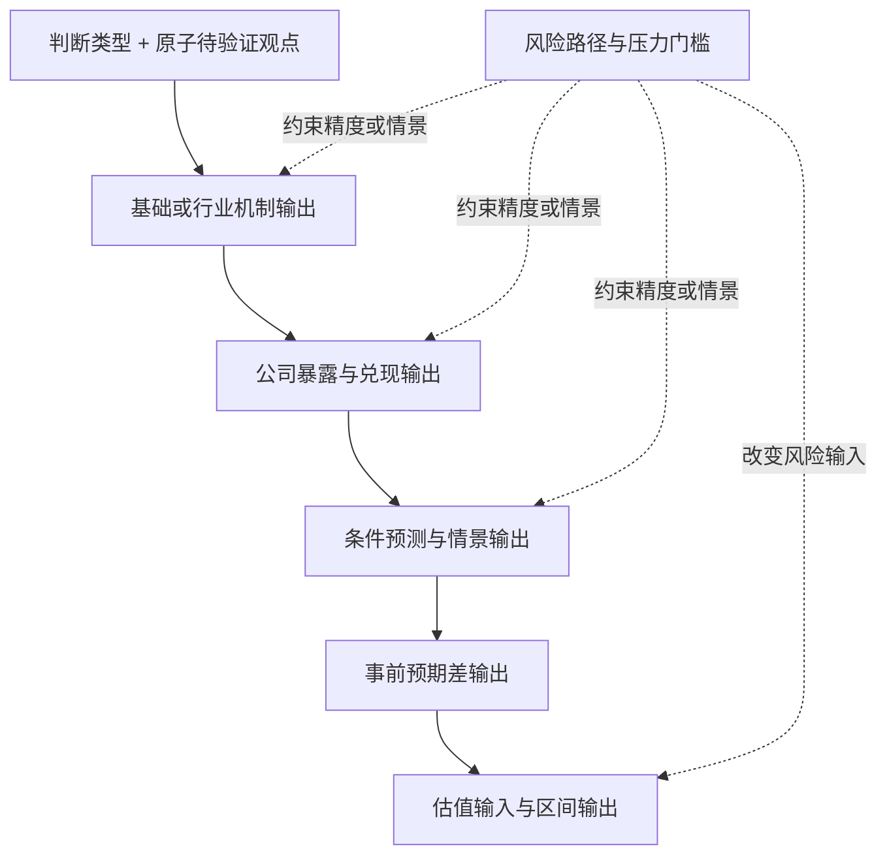

# 框架依赖与输出要求

## 1. 一份登记表，四种门槛

[`00_framework_dependency_registry.yaml`](00_framework_dependency_registry.yaml) 是框架层级、进入条件、输出门槛、质量门槛、下游可接续内容与职责交接的**唯一登记表**。框架 front matter 不得出现 `builds_on`；正文不得重新声明 `hard_prerequisites`、`quality_gate` 或静态 `downstream_unlocks`。

调用框架时必须区分四件事：

| 概念 | 回答什么 | 失败后的动作 |
|---|---|---|
| `entry_requires` | 是否已具备对象、范围和判断单元，可以进入框架拆问题 | 不进入，返回 01/02 补边界 |
| `output_gates` | 现有前置和最低证据允许写出哪一种待验证观点 | 只禁止该级输出；较低级输出仍可保留 |
| `quality_gates` | 输出是否达到所需精度、强度和可用范围 | 限制为条件式、区间或 `provisional` |
| `downstream_unlocks` | 哪个输出通过后，下一步可以考虑什么 | 只是允许进入，不代表自动调用或自动成立 |

`boundary_handoffs` 只声明职责归属。例如价格框架可以输出价格状态和实现价路径，但“能否进入利润”由 BF-EE-01 承接；这不是 BF-PC-01 对 BF-EE-01 的反向依赖。

## 2. 研究链与默认方向

```text
判断类型选用与问题拆解
→ 基础机制：结构 / 宏观 / 政策 / 供需 / 传导 / 价格
→ 行业专业机制：半导体周期、应用、设计、制造、封装、设备、材料、国产替代
→ 公司兑现：商业模式 / 财务质量 / 业绩弹性 / 治理 / 资本配置
→ 市场定价：经营预测 / 事前预期差 / 风险 / 估值输入
```

这不是必须完整执行的流水线。任务可以停在任一输出门槛；只有要形成更高层结论时，才加载该门槛明确要求的上游输出。



图只表达默认研究方向，不承担登记表中的依赖定义。精确门槛始终读取登记表。

## 3. 输出级门槛示例

以 BF-PC-01 为例：

```yaml
entry_requires: [judgment_unit, product_and_price_basis]
output_gates:
  price_state:
    requires: [same_basis_price_series]
    minimum_evidence: [transaction_or_settlement_validation, volume_or_spread_cross_check]
  driver_attribution:
    requires: [price_state, BF-SD-01.balance_state]
    minimum_evidence: [inventory_order_and_lead_time, cost_mix_or_contract_alternative_test]
  realized_price_path:
    requires: [price_state, contract_or_mix_definition]
    minimum_evidence: [contract_reset_or_discount, realized_asp_or_equivalent]
boundary_handoffs:
  profit_pass_through: BF-EE-01
```

因此：

- 只有同口径成交或结算序列时，可以判断 `price_state`；
- 要解释涨价驱动，才需要 BF-SD-01 的 `balance_state`；
- 要讨论公司实现价，需补合同、折扣和产品结构；
- 要讨论利润，停止在本框架并交给 BF-EE-01。

IF-DES-01 同理：产品处于流片、验证还是量产，可由 `commercialization_stage` 单独输出；商业化质量需要 BF-BM-01 与竞争边界；收入、利润和现金必须交给 BF-EE-01。

## 4. 本次调用的门槛状态

框架调用保留统一 `gate_status`，它只表示“本次调用及所选输出中最弱门槛”的状态，不表示整个框架已经成立。

| 状态 | 含义 | 下游动作 |
|---|---|---|
| `passed` | 本次实际使用的输出门槛全部满足 | 可按登记表考虑相应下游 |
| `provisional` | 门槛仅由待验证前置或降级证据满足 | 允许条件式输出；下游不得更强 |
| `failed` | 本次目标输出的关键前置、口径或最低证据缺失/被反证 | 禁止该目标输出；检查是否可降到较低门槛 |
| `not_applicable` | 经说明该输出门槛与本次判断无关 | 裁剪，不视为缺口 |

任何下游输出继承最弱前置状态。`failed` 不等于整份框架不可使用：例如价格归因失败时，已验证的价格状态仍可保留。

## 5. 框架输出要求（Framework Output Contract）

每个正式框架声明自己能生成哪些候选对象，并用 `output_gate_refs` 引用登记表中的门槛。框架正文不复制依赖关系。

```yaml
framework_layer: mechanism | company_realization | market_pricing
output_gate_refs: [BF-XX-01.output_a, BF-XX-01.output_b]
judgment_types: []
state_variable_candidates: []
signal_candidates: []
output_objects: []
evidence_requirements: []
falsification_conditions: []
scenarios: []
```

单次任务使用统一的运行记录结构：

```yaml
framework_output:
  framework_id: BF-XX-01
  framework_layer: mechanism | company_realization | market_pricing
  gate_status: passed | provisional | failed | not_applicable
  prerequisite_judgment_refs: []
  judgment_types: []
  candidate_claims:
    - claim_id: CC-01
      atomic_claim: "<只含一个可裁决命题>"
      mechanism_ref: "<解释路径或 null>"
      output_gate_ref: BF-XX-01.output_a
      gate_status: provisional
  state_variable_candidates: []
  signal_candidates: []
  evidence_requirements: []
  falsification_conditions: []
  scenarios: []
  output_objects: []
  downstream_unlocks: []
  unresolved_gaps: []
```

`downstream_unlocks` 是本次实际通过门槛后，从登记表解析得到的结果，不是框架正文的静态清单。旧任务中 `candidate_claims` 可暂时使用字符串；新任务优先使用上面的原子命题结构。

### 待验证观点如何拆开写

结论与机制分开保存：

```yaml
atomic_claim: "目标客户渠道库存低于其正常区间"
mechanism_ref: null
```

```yaml
atomic_claim: "本轮订单回升主要由终端消耗而非补库解释"
mechanism_ref: PATH-DEMAND-01
```

不要在同一句中同时写“库存低、因为需求强、公司受益、估值提升”。这些是不同门槛、不同证据和不同裁决单元。

## 6. 估值专门门槛

BF-VA-01 的 `valuation_entry` 必须同时引用：

1. 已有产业状态或机制判断单元；
2. `BF-EE-01.earnings_bridge`；
3. `BF-FS-01.conditional_forecast`；
4. `BF-EG-01.prior_expectation_baseline`；
5. 明确的 `valuation_input_change`。

缺少任一项时，只允许输出 `valuation_gate: failed` 和缺口。任一前置为 `provisional` 时，估值只能保持条件式或区间，不得升格为确定性目标价。

## 7. 02、03、04 的职责边界

| 02：判断类型选用与问题拆解 | 03：证据准备 | 04：裁决 |
|---|---|---|
| 选择判断类型，生成原子待验证观点 | 把候选变量、信号和最低证据变成可取证任务 | 判断证据是否支持、削弱、争议或阻断 |
| 提出主解释和竞争解释 | 获取能区分解释的观测与反证 | 比较解释力并决定命中哪条路径 |
| 声明“什么事实可能推翻” | 检查对象、口径、时间和证据可用性 | 决定是否降级、停止、切换或改判 |
| 定义输出门槛和最低证据 | 返回门槛满足情况与缺口 | 执行判断等级和版本变更 |

02 不得预写“看到某事实就必须降到某判断等级”；它只声明候选反证、阻断点和切换信号。具体裁决动作及等级全部由 04 执行。

## 8. 通用情景、映射与来源

- 情景只在存在真实不确定变量时生成；每个情景必须有进入条件、关键变量和退出条件。不得机械复制“乐观/基准/悲观”。
- 通用本体映射遵循一级、领域扩展、任务候选/缺口三层规范；单份行业框架只保留特有对象或关系，不复制通用映射表。
- 来源分层、证据组合和获取渠道由 [`知识库_03取证`](../知识库_03取证/README.md) 管理。框架只写与特有输出直接相关的最低证据，不复制通用来源类型。
- 通用自检由编写验收标准与 `validate_frameworks.py` 执行；单份框架只保留行业特有停止条件。
