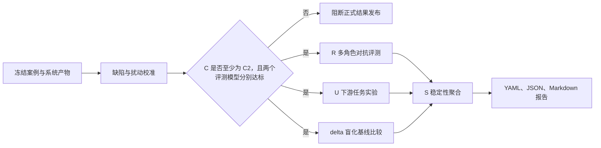

# 01 评测总纲

## 1. 评测要支持的决策

这套评测体系服务两个决策：

1. 一份研究产出的核心判断是否值得在当前证据边界内相信；
2. 复杂研究流程相较于问题直答或普通证据摘要，是否产生了足以抵偿流程成本的研究价值。

它不试图证明报告是客观真理，也不让 AI 模拟一句“研究员觉得不错”。评测通过可重复任务、对抗审阅、证据扰动和基线实验，输出“代理可靠概率”和相对增益。

## 2. 最终回答与不回答的问题

### 2.1 能回答

- 核心事实、最低证据组合和推理路径是否支持主要判断；
- 报告是否遗漏最强反证或把竞争解释写成确定因果；
- 结论强度是否超过证据许可；
- 新信息出现后，系统是否会保持、削弱、改判或正确弃答；
- 使用产出后，下游模型能否更准确地复述、跟踪、更新和设计调研问题；
- 系统产出相对问题直答稿和同证据摘要稿的胜率、任务增益及错误降低；
- 上述结论在模型、提示词、重复运行和候选顺序变化下是否稳定；
- 评测器能否识别已知缺陷，而不是无条件吹捧候选。

### 2.2 不能回答

- 报告在冻结证据之外是否永远正确；
- 对全部行业、公司、时间窗口或未知任务是否泛化；
- 研究结论是否直接构成投资建议；
- 四题试点结果是否代表全部研究流程；
- mock 运行的高分是否代表真实模型表现。

## 3. 核心架构

三个核心结果衡量研究价值，两个护栏决定结果是否可以解释和发布。

| 类型 | 指标 | 作用 |
|---|---|---|
| 核心结果 | `R` 可靠性 | 核心判断在冻结证据边界内是否值得相信 |
| 核心结果 | `U` 任务有用性 | 系统产物是否帮助完成真实下游研究任务 |
| 核心结果 | `delta` 相对增益 | 相比问题直答、冻结证据和普通摘要提升多少 |
| 发布护栏 | `S` 稳定性 | 结论是否依赖特定模型、提示或候选位置 |
| 发布护栏 | `C` 评测可信度 | 评测器是否通过缺陷、错杀、定位和扰动校准 |

旧式“证据支撑、推理成立、反证处理、判断强度、问题保持、交付可用性”只作为诊断项：前四项解释 `R`，后两项解释 `U`。终点命中只属于流程护栏，不等同研究质量。

## 4. 核心原则

### 4.1 不设综合分

`R/U/delta/S/C` 不加权合成。综合分会掩盖三类关键差异：

- 硬错误不能被表达质量抵消；
- 高任务有用性不能证明核心判断可靠；
- 高可靠性也不能证明复杂流程相对普通摘要有增益。

正式报告分别展示等级、错误、分歧、点估计和区间。

### 4.2 先校准评测器，再评价系统

正式流程先运行十类缺陷、正常版错杀和四类证据扰动。整体或任一评测模型低于 `C2`，立即停止正式 `R/U/delta` 阶段。

### 4.3 评整组任务，不评一句印象

可靠性通过事实、证据、推理和对抗角色审阅；有用性通过核心复述、跟踪计划、信息更新和调研问题四项任务测量。

### 4.4 相对基线优先

复杂流程的价值必须相对以下条件观察：

- A：只有原始问题；
- B：问题与冻结证据；
- C：问题与直接生成报告；
- D：问题与系统允许的最终产物；
- E：问题、系统产物与关键证据，作为诊断组。

### 4.5 证据与时间冻结

正式评测不临时联网补证。事实核验只使用案例冻结时已经保存的短摘录、表格单元、定位和哈希，并严格过滤信息截止日后的材料。

### 4.6 正确停止也是研究价值

证据冲突时保留争议、证据不足时暂不可判断，都是有效终点。评测不强迫所有案例生成完整 05 报告。

## 5. 总体运行顺序

## 6. 当前试点与分层

首轮只运行四个深度案例：

| 案例 | 分层 | 主要检验 |
|---|---|---|
| RV-T01 | 正式报告价值 | 分产品周期判断、证据强度、转向条件 |
| RV-T02 | 正式报告价值 | 政策与产业分化、商业兑现、范围外推 |
| RV-T07 | 克制与停止 | 冲突证据能否保留争议 |
| RV-T08 | 克制与停止 | 证据不足时能否拒绝编造统一日期 |

两个分层分别汇总，不报告“四题总通过率”。扩展其他案例前，必须先补齐冻结证据和密封裁决契约，而不是把旧任务标题直接迁移进来。

## 7. 发布纪律

正式结果必须同时满足：

- 运行配置通过模型隔离校验；
- 两个评测模型分别达到 `C2`；
- 整体 `C` 至少为 `C2`；
- 所有请求成功或失败均进入日志，不存在静默丢失；
- `report_value` 与 `restraint` 分层展示；
- 代理可靠概率明确标注为代理概率，不写成客观正确率；
- 报告声明案例边界、最弱判断、最强反证和主要分歧。

首版不要求专家标签。体系预留 5%—10% 专家盲审字段，后续用于检验 AI 代理评测与真实研究判断的一致性。
